# 网络
## 反向代理与正向代理
### 正向代理
正向代理，是一个位于客户端和原始服务器(origin server)之间的服务器，为了从原始服务器取得内容，客户端向代理发送一个请求并指定目标(原始服务器)，然后代理向原始服务器转交请求并将获得的内容返回给客户端。客户端必须要进行一些特别的设置才能使用正向代理。
### 反向代理
反向代理正好相反，对于客户端而言它就像是原始服务器，并且客户端不需要进行任何特别的设置。客户端向反向代理 的命名空间(name-space)中的内容发送普通请求，接着反向代理将判断向何处(原始服务器)转交请求，并将获得的内容返回给客户端，就像这些内容 原本就是它自己的一样。
### 用途
正向代理的典型用途是为在防火墙内的局域网客户端提供访问Internet的途径。正向代理还可以使用缓冲特性减少网络使用率。反向代理的典型用途是将 防火墙后面的服务器提供给Internet用户访问。反向代理还可以为后端的多台服务器提供负载平衡，或为后端较慢的服务器提供缓冲服务。
## 输入url后
### 整体过程
+ **1、DNS解析**
+ **2、建立TCP链接（三次握手）**
+ **3、发出http请求**
+ **4、服务端处理请求，返回数据**
+ **5、客户端接收响应**
+ **6、浏览器解析HTML、渲染页面**

## get和post的区别
本质上get和post都是tcp链接，并无差别。但由于http的规范和浏览器与服务器的限制，导致他们在应用上有所不同
1. get参数通过url传递（可见不安全），post放在请求体中（不可见相对安全）
2. get长度有所限制，post长度是无限制的
3. get产生的url可以被收藏书签，post不可以
4. get请求会被浏览器主动缓存，post不会被主动缓存
5. get在浏览器回退时是无害的，而post会再次提交请求。
6. get只允许ASCII.,post没有编码限制，允许发二进制的。
7. get请求只能进行url编码，而post支持多种编码方式。
## http有哪些方法
+ http1.0定义了三种请求方法：get、post、head
+ http1.1新增了五种请求方法：options、put、delete、trace、connect
### 这些方法的具体作用
+ get：GET方法用于使用给定的URI从给定服务器中检索信息，即从指定资源中请求数据。使用GET方法的请求应该只是检索数据，并且不应对数据产生其他影响。GET请求是可以缓存的，我们可以从浏览器历史记录中查找到GET请求，还可以把它收藏到书签中；且GET请求有长度限制，仅用于请求数据（不修改）。
+ head：请求资源的头部信息，并且这些头部与http的get方法请求时返回一致。该请求方法的一个使用场景是在下载一个大文件前先获取其大小再决定是否要下载，以此可以节约宽带资源
+ post：POST方法用于将数据发送到服务器以创建或更新资源，POST请求永远不会被缓存，且对数据长度没有限制；我们无法从浏览器历史记录中查找到POST请求。
+ put：用于将数据发送到服务器以创建或更新资源，它可以用上传的内容替换目标资源中的所有当前内容。它会将包含的元素放在所提供的URI下，如果URI指示的是当前资源，则会被改变。如果URI未指示当前资源，则服务器可以使用该URI创建资源。
+ delete：delete方法用来删除指定的资源，它会删除URI给出的目标资源的所有当前内容。
+ options:用来描述了目标资源的通信选项，会返回服务器支持预定义URL的HTTP策略。
+ connect:用来建立到给定URI标识的服务器的隧道；它通过简单的TCP / IP隧道更改请求连接，通常实使用解码的HTTP代理来进行SSL编码的通信（HTTPS）。
+ trace:用于沿着目标资源的路径执行消息环回测试；它回应收到的请求，以便客户可以看到中间服务器进行了哪些（假设任何）进度或增量。
## put和post方法的区别
put和post都是更新、创建资源。在创建资源时候，put可以指定资源路径，post无法指定资源路径

因而put是幂等操作，即重复操作不会产生变化，多次put的创建请求与1次**相同**，只会创建一个资源

post的重复操作截然不同，10次post请求将会创建10个资源
## put和patch的区别
**put和patch都是可新资源，而patch用来对已知资源进行局部更新**

比如我们有一篇文章的地址 https://www.xxxx.com/xxxx/1 ,这篇文章的可以表示为:
```js
article = { author: 'dxy', creationDate: '2019-6-12', content: '11111111111111111', id: 820357430 }
```
当我们要修改文章的作者时，我们可以直接发送 PUT https://www.xxxx.com/xxxx/1 ，这个时候的数据应 该是:
```js
{ author: 'dxy', creationDate: '2019-6-12', content: '2222222', id: 820357430 }
```
这种直接覆盖资源的修改方式应该为put，但是你觉得每次都带有这么多无用的信息，那么可以发送 PATCH https://www.xxxx.com/xxxx/1 ，这个时候只需要:
```js
 { content: '2222222'}
```
## http的请求报文
### 包含部分
+ 请求行
>请求行包括：请求方法、url、http协议版本它们用空格分隔。例如GET /index.html HTTP/1.1
+ 请求头
>请求头部由关键字/值对组成，每行一对，关键字和值用英文冒号“:”分隔
+ 请求体
> post put等携带的数据

## http的响应报文
+ 响应行
>由报文协议版本和状态码状态描述构成
+ 响应头
+ 响应体
>服务器响应的数据

## http头部信息
1. 通用头

**通用头包含请求和响应消息都支持的头域**

Cache-Control：指定请求和响应遵循的缓存机制。

Connection：控制连接
>HTTP请求是基于TCP连接的，TCP的请求会包含（三次握手，中间请求，四次挥手）在HTTP/1.0时代，一个HTTP请求就要三次握手和四次挥手，当一个网页中包含大量的图片或者其它外部资源时，加载一个Document要很多个HTTP请求，也就意味着要多次三次握手和四次挥手，这样就造成了网络资源的浪费.到了HTTP/1.1的时候，通过请求头的connection字段用来申明，作用就是减少TCP握手次数，开始的三次握手后就可以进行多次HTTP正文请求，可以长时间的保持，也就是加载一个Document的时候，即使有大量的图片等，也只用进行一次握手，这样就大大的减少了传输量了。keep-alive就表示之前已经进行过握手，可以直接进行HTTP正文传输，close表示结束，我接下来没有东西了，可以进行四次挥手结束这个TCP连接了
Upgrade: 升级为其他协议

via: 代理服务器的相关信息

Wraning 错误和警告通知

Transfor-Encoding 报文主体的传输编码格式 

Trailer 报文末端的首部一览

Pragma 报文指令；最常用的是Pragma:no-cache。在HTTP/1.1协议中，它的含义和Cache-Control:no-cache相同。

Date 创建报⽂的⽇期

2. 实体头

**举个例子来说Content-Length和Content-Type这两个Header就是实体头（Entity Header），他们出现的作用主要是对Entity（请求体、响应体）的一些信息进行描述，上面的虽然也是Header，但并非是对Entity进行描述的**

Allow ：资源可以持http请求的方法

Content-Language 实体的资源语言

Content-Encoding 服务器通过这个头告诉浏览器数据的压缩格式

Content-Length 服务器通过这个头告诉浏览器回送数据的长度

Content-Type 服务器通过这个头告诉浏览器回送数据的类型。Content-Type实体头用于向接收方指示实体的介质类型，指定HEAD方法送到接收方的实体介质类型，或GET方法发送的请求介质类型。

Last-Modified：指定服务器上保存内容的最后修订时间。

Expires：告诉浏览器把回送的资源缓存多长时间 -1或0则是不缓存

其中三种禁止浏览器缓存的头字段：

Expires：-1或0

Cache-Control：no-cache

Pragma：no-cache

3. 请求头
Accept： 浏览器可接受的MIME类型。

Accept-Charset：浏览器可接受的字符集。

Accept-Encoding：浏览器能够进行解码的数据编码方式，比如gzip。Servlet能够向支持gzip的浏览器返回经gzip编码的HTML页面。许多情形下这可以减少5到10倍的下载时间。

Accept-Language：浏览器所希望的语言种类，当服务器能够提供一种以上的语言版本时要用到。

Authorization：授权信息，通常出现在对服务器发送的WWW-Authenticate头的应答中。

Host： 客户机通过这个头告诉服务器，想访问的主机名。Host头域指定请求资源的Intenet主机和端口号，必须表示请求url的原始服务器或网关的位置。HTTP/1.1请求必须包含主机头域，否则系统会以400状态码返回。

If-Modified-Since：客户机通过这个头告诉服务器，资源的缓存时间。只有当所请求的内容在指定的时间后又经过修改才返回它，否则返回304“Not Modified”应答。

Referer：客户机通过这个头告诉服务器，它是从哪个资源来访问服务器的(防盗链)。包含一个URL，用户从该URL代表的页面出发访问当前请求的页面。

User-Agent：User-Agent头域的内容包含发出请求的用户信息。浏览器类型，如果Servlet返回的内容与浏览器类型有关则该值非常有用。

Cookie：客户机通过这个头可以向服务器带数据，这是最重要的请求头信息之一。
4. 响应头
Refresh：告诉浏览器隔多久刷新一次，以秒计。

Server：服务器通过这个头告诉浏览器服务器的类型。

Set-Cookie：设置和页面关联的Cookie。Servlet不应使用response.setHeader(“Set-Cookie”, …)，而是应使用HttpServletResponse提供的专用方法addCookie。

WWW-Authenticate：客户应该在Authorization头中提供什么类型的授权信息?在包含401(Unauthorized)状态行的应答中这个头是必需的。

vary 代理服务器的缓存信息

Location 令客户端重定向的URI
## http状态码
### 2xx 成功
+ 200 OK  表示从客户端发来的请求在服务器端被正确处理
+ 201 Created 请求已经被实现，而且有一个新的资源已经依据请求的需要而建立
+ 202 Accepted 请求已接受，但是还没执行，不保证完成请求
+ 204 No content 表示请求成功，但响应报文不含实体的主体部分
+ 206 Partial Content，进行范围请求
### 3xx 重定向
+ 301 moved permanently，永久性重定向，表示资源已被分配了新的 URL
+ 302 found，临时性重定向，表示资源临时被分配了新的 URL 
+ 303 see other，表示资源存在着另一个 URL
+ 304 not modified，表示服务器允许访问资源，但因发生请求未满足条件的情况
+ 307 temporary redirect，临时重定向，和302含义相同
### 4xx 客户端错误
+ 400 bad request，请求报文存在语法错误
+ 401 unauthorized，表示发送的请求需要有通过 HTTP 认证的认证信息
+ 403 forbidden，表示对请求资源的访问被服务器拒绝
+ 404 not found，表示在服务器上没有找到请求的资源
+ 408 Request timeout, 客户端请求超时
+ 409 Confict, 请求的资源可能引起冲突
### 5xx 服务器错误
+ 500 internal sever error，表示服务器端在执行请求时发生了错误
+ 501 Not Implemented 请求超出服务器能力范围，例如服务器不支持当前请求所需要的某个功能，或者请求是服务 器不支持的某个方法
+ 503 service unavailable，表明服务器暂时处于超负载或正在停机维护，无法处理请求
+ 505 http version not supported 服务器不支持，或者拒绝支持在请求中使用的 HTTP 版本
### 同样是重定向307，303，302的区别？
302是http1.0的协议状态码，在http1.1版本的时候为了细化302状态码又出来了两个303和307。

303明确表示客户端应当采用get方法获取资源，他会把POST请求变为GET请求进行重定向。 307会遵照浏览器标准， 不会从post变为get。
## http中的keep-alive
>在早期的HTTP/1.0中，每次http请求都要创建一个连接，在创建连接的过程需要消耗资源和时间，为了减少资源消耗， 缩短响应时间，就需要重用连接。在后来的HTTP/1.0中以及HTTP/1.1中，引入了重用连接的机制，就是在http请求头中 加入Connection: keep-alive来告诉对方这个请求响应完成后不要关闭，下次咱们还用这个请求继续交流。协议规定HTTP/1.0如果想要保持长连接，需要在请求头中加上Connection: keep-alive。
## http1.0与http1.1区别
1. **缓存处理**， 在HTTP1.0中主要使用header里的If-Modified-Since,Expires来做为缓存判断的标准，HTTP1.1则引入了更多的缓存控制策略例如Entity tag，If-Unmodified-Since, If-Match, If-None-Match等更多可供选择的缓存头来控制缓存策略。
2. **带宽优化及网络连接的使用**，HTTP1.0中，存在一些浪费带宽的现象，例如客户端只是需要某个对象的一部分，而服务器却将整个对象送过来了，并且不支持断点续传功能，HTTP1.1则在请求头引入了range头域，它允许只请求资源的某个部分，即返回码是206（Partial Content），这样就方便了开发者自由的选择以便于充分利用带宽和连接。
3. **错误通知的管理**，在HTTP1.1中新增了24个错误状态响应码，如409（Conflict）表示请求的资源与资源的当前状态发生冲突；410（Gone）表示服务器上的某个资源被永久性的删除。
4. **Host头处理**，在HTTP1.0中认为每台服务器都绑定一个唯一的IP地址，因此，请求消息中的URL并没有传递主机名（hostname）。但随着虚拟主机技术的发展，在一台物理服务器上可以存在多个虚拟主机（Multi-homed Web Servers），并且它们共享一个IP地址。HTTP1.1的请求消息和响应消息都应支持Host头域，且请求消息中如果没有Host头域会报告一个错误（400 Bad Request）。
5. **长连接**，HTTP 1.1支持长连接（PersistentConnection）和请求的流水线（Pipelining）处理，在一个TCP连接上可以传送多个HTTP请求和响应，减少了建立和关闭连接的消耗和延迟，在HTTP1.1中默认开启Connection： keep-alive，一定程度上弥补了HTTP1.0每次请求都要创建连接的缺点。
## http2.0优势
### 1.单一场链接，多路由复用
+ 在HTTP/2中，客户端向某个域名的服务器请求页面的过程中，只会创建一条TCP连接，即使这页面可能包含上百个资源。 单一的连接应该是HTTP2的主要优势，单一的连接能减少TCP握手带来的时延 。HTTP2中用一条单一的长连接，避免了创建多个TCP连接带来的网络开销，提高了吞吐量。
+ HTTP2虽然只有一条TCP连接，但是在逻辑上分成了很多stream。 HTTP2把要传输的信息分割成一个个二进制帧，首部信息会被封装到HEADER Frame，相应的request body就放到DATA Frame,一个帧你可以看成路上的一辆车,只要给这些车编号，让1号车都走1号门出，2号车都走2号门出，就把不同的http请求或者响应区分开来了。但是，这里要求同一个请求或者响应的帧必须是有有序的，要保证FIFO的，但是不同的请求或者响应帧可以互相穿插。
### 2.header压缩
HTTP/1.1的header带有大量信息，而且每次都要重复发送。HTTP/2 为了减少这部分开销，采用了HPACK 头部压缩算法对Header进行压缩。
+ HTTP/2在客户端和服务器端使用“首部表”来跟踪和存储之前发送的键－值对，对于相同的数据，不再通过每次请求 和响应发送
+ 首部表在HTTP/2的连接存续期内始终存在，由客户端和服务器共同渐进地更新;
+ 每个新的首部键－值对要么被追加到当前表的末尾，要么替换表中之前的值。
> 你可以理解为只发送差异数据，而不是全部发送，从而减少头部的信息量
### 3.服务器推送
简单来讲就是当用户的浏览器和服务器在建立连接后，服务器主动将一些资源推送给浏览器并缓存起来的机制。有了缓存，当浏览器想要访问已缓存的资源的时候就可以直接从缓存中读取了。
## http缓存
### 基本步骤
1. 客户端向服务器发出请求，请求资源
2. 服务器返回资源，并通过响应头决定缓存策略
3. 客户端根基响应头的策略决定是否缓存资源（这里假设是），并将响应头与资源缓存下来
4. 在客户端再次请求且命中资源的时候，此时客户端去检查上次缓存的缓存策略，根据策略不同，是否过期等判断是直接读取本地缓存还是与服务器协商缓存
### 强制缓存
强制缓存在缓存数据未失效的情况下（即Cache-Control的max-age没有过期或者Expires的缓存时间没有过期），那么就会直接使用浏览器的缓存数据，不会再向服务器发送任何请求。强制缓存生效时，http状态码为200。这种方式页面的加载速度是最快的，性能也是很好的，但是在这期间，如果服务器端的资源修改了，页面上是拿不到的，因为它不会再向服务器发请求了。这种情况就是我们在开发种经常遇到的，比如你修改了页面上的某个样式，在页面上刷新了但没有生效，因为走的是强缓存，所以Ctrl + F5一顿操作之后就好了。 跟强制缓存相关的header头属性有（Pragma/Cache-Control/Expires）
+ Expires：Expires是http1.0提出的一个表示资源过期时间的header，它描述的是一个绝对时间，由服务器返回， Expires 受限于本地时间，如果修改了本地时间，可能会造成缓存失效
+ Cache-Control: Cache-Control 出现于 HTTP / 1.1，优先级高于 Expires ,表示的是相对时间，在缓存有效期内命中缓存，浏览器会直接读取本地的缓存资源，当缓存过期之后会与服务器进行协商。
### 协商缓存
当第一次请求时服务器返回的响应头中没有Cache-Control和Expires或者Cache-Control和Expires过期抑或它的属性设 置为no-cache时，那么浏览器第一次请求时就会与服务器进行协商。

如果缓存和服务端资源的最新版本是一致的，那么就无需再次下载该资源，服务端直接返回304 Not Modified 状态码， 如果服务器发现浏览器中的缓存已经是旧版本了，那么服务器就会把最新资源的完整内容返回给浏览器，状态码就是 200 Ok。

**服务器判断缓存是否是新鲜的方法就是依靠HTTP的另外两组信息**

1. Last-Modified/If-Modified-Since

客户端首次请求资源时，服务器会把资源的最新修改时间 Last-Modified:Thu, 19 Feb 2019 08:20:55 GMT 通过响应部首发送给客户端，当再次发送请求是，客户端将服务器返回的修改时间放在请求头 If-Modified-Since:Thu, 19 Feb 2019 08:20:55 GMT 发送给服务器，服务器再跟服务器上的对应资源进行比对，如果服务器的资源更新，那么返回最新的资 源，此时状态码200，当服务器资源跟客户端的请求的时间一致，证明客户端的资源是最新的，返回304状态码， 表示客户端直接用缓存即可。

2. ETag/If-None-Match

ETag的流程跟Last-Modified是类似的，区别就在于ETag是根据资源内容进行hash，生成一个信息摘要，只要资源内容 有变化，这个摘要就会发生巨变，通过这个摘要信息比对，即可确定客户端的缓存资源是否为最新，这比Last-Modified 的精确度要更高。
## https
### 基本流程


1. 1.Client发起一个HTTPS（比如https://juejin.im/user/5a9a9cdcf265da238b7d771c）的请求，根据RFC2818的规定，Client知道需要连接Server的443（默认）端口。

2. Server把事先配置好的公钥证书（public key certificate）返回给客户端。

3. Client验证公钥证书：比如是否在有效期内，证书的用途是不是匹配Client请求的站点，是不是在CRL吊销列表里面，它的上一级证书是否有效，这是一个递归的过程，直到验证到根证书（操作系统内置的Root证书或者Client内置的Root证书）。如果验证通过则继续，不通过则显示警告信息。


4. Client使用伪随机数生成器生成加密所使用的对称密钥，然后用证书的公钥加密这个对称密钥，发给Server。

5. Server使用自己的私钥（private key）解密这个消息，得到对称密钥。至此，Client和Server双方都持有了相同的对称密钥。

6. Server使用对称密钥加密“明文内容A”，发送给Client。

7. Client使用对称密钥解密响应的密文，得到“明文内容A”。

8. Client再次发起HTTPS的请求，使用对称密钥加密请求的“明文内容B”，然后Server使用对称密钥解密密文，得到“明文内容B”。
### 数字签名
CA通过

数字签名就是服务端请求CA，CA用自带的hash算法对证书的内容进行hash得到一个摘要，（加密算法直接对信息加密效率太慢）再用CA的私钥进行加密，最终组成数字签名，服务端将签名后的证书给客户端。

当别人把他的证书发过来时候，客户端再用同样的hash算法，再次生成**消息摘要**，然后用CA的公钥对发过来的数字签名解密，得到CA创建的**消息摘要**，两者进行对比就知道有没有被篡改。验证通过后，客户端便可以取到证书里面的公钥，服务器存有这个公钥对应的私钥。
## tcp

### 字段含义
+ **URG** 紧急指针是否有效。为1表示某一位需要被有限处理
+ **ACK** 确认号是否有效， 一般置为1
+ **PUSH** 提示接收端应用程序立即从tcp缓冲区把数据读走
+ **RST** 对方要求重新建立连接，复位
+ **SYN** 请求建立连接，并在其序列号的字段进行序列号的初始值设定。建立连接，设置为1
+ **FIN** 希望断开连接
### 三次握手过程理解

1. **第一次握手** 客户端将标志位SYN置1，产生随机值seq = x,，并进入到（SYN_SENT）状态，等待服务器确认；SYN：同步序列编号（Synchronize Sequence Numbers）。
2. **第二次握手** 服务器收到syn包，必须确认客户的SYN（ack=x+1），**同时(实际二次握手是确认请求和发出请求两步)**自己也发送一个SYN包（SYN=1），即SYN+ACK包，此时服务器进入SYN_RECV状态；
3. **第三次握手** 户端收到确认报文之后，通知上层应用进程连接已建立，并向服务器发出确认报文，其首部：ACK=1,ack=y+1。当服务器收到客户端的确认报文之后，也通知其上层应用进程连接已建立。
### TCP 为什么三次握手而不是两次握手
**答案1：**

为了实现可靠数据传输， TCP 协议的通信双方， 都必须维护一个序列号， 以标识发送出去的数据包中， 哪些是已经被对方收到的。 三次握手的过程即是通信双方相互告知序列号起始值， 并确认对方已经收到了序列号起始值的必经步骤

如果只是两次握手， 至多只有连接发起方的起始序列号能被确认， 另一方选择的序列号则得不到确认

**答案2**
防止已失效的连接请求又传送到服务器端，因而产生错误
### TCP四次挥手过程理解

1. **第一次挥手** 数据传输结束以后，客户端的应用程序发出链接释放报文，并停止发送数据，其首部：FIN=1，seq = u；
2. **第二次挥手** 服务器端收到链接释放报文段之后，发出确认报文。其首部：ACK = 1；ack = u + 1；seq = v；此时本次链接计入了办关闭状态，客户端不再向服务器发送数据。而服务器端仍会继续发送
3. **第三次挥手** 若服务器已经没有要向客户端发送的数据，其应用进程就通知服务器释放TCP连接。这个阶段服务器所发出的最后一个报文的首部应为：FIN=1,ACK=1,seq=w,ack=u+1。
4.  **第四次挥手** 客户端收到连接释放报文段之后，必须发出确认：ACK=1,seq=u+1,ack=w+1。 再经过2MSL(最长报文端寿命)后，本次TCP连接真正结束，通信双方完成了他们的告别。
### 为什么连接的时候是三次握手，关闭的时候却是四次挥手
因为当server端收到client端的SYN连接请求报文后，可以直接发送SYN+ACK报文。其中ACK报文是用来应答的，SYN报文是用来同步（请求）的。但关闭连接时，当server收到FIN报文后，很可能有其他的报文还需要发送，不会立即关闭socket，所以只能先回复一个ACK报文，告诉client端，“你发的FIN报文我收到了”。只有等到我Server端所有的报文都发送完了，才能发送FIN报文。因此不能一起发送。故需要四步握手。
### 为什么TIME_WAIT状态需要经过2MSL(最大报文段生存时间)才能返回到CLOSE状态？
网络的不可靠性，最后一个ACK可能会丢失，所以TIME_WAITE状态就是用来重发可能丢失的ACK报文的。在client发送出最后的ACK回复，但该ACK可能会丢失，如果server没有收到ACK，将会不断重复发送FIN片段。所以Client不能立即关闭。它必须确认Server接受到了ACK。Client会在发送出ACK之后进入到TIME_WAIT状态。Client会设置一个计时器，等待2MSL的时间。如果在该时间内再次收到FIN，那么Client会重发ACK并再次等待2MSL。所谓的2MSL是两倍的MSL(Maximum Segment Lifetime)。MSL指一个片段在网络中最大的存活时间，2MSL就是一个发送和一个回复所需的最大时间。如果直到2MSL，Client都没有再次收到FIN，那么Client推断ACK已经被成功接收，则结束TCP连接。
### 如果已经建立了连接，但是客户端突然出现故障了怎么办？
TCP还设有一个保活计时器，显然，客户端如果出现故障，服务器不能一直等下去，白白浪费资源。服务器每收到一次客户端的请求后都会重新复位这个计时器，时间通常是设置为2小时，若两小时还没有收到客户端的任何数据，服务器就会发送一个探测报文段，以后每隔75分钟发送一次。若一连发送10个探测报文仍然没反应，服务器就认为客户端出了故障，接着就关闭连接。
## 跨域
### 同源策略
协议 域名 端口相同
### 为什么浏览器不支持跨域
### jsonp 实现跨域
### cors实现跨域
### postMessage实现跨域
### window.name实现跨域
### location.hash实现跨域
### http-proxy 实现跨域
### nginx 实现跨域
### websocket 实现跨域
### document.domain实现跨域 
## 浏览器缓存原理

### 目的
浏览器缓存（Browser Caching）是为了节约网络的资源加速浏览，浏览器在用户磁盘上对最近请求过的文档进行存储，当访问者再次请求这个页面时，浏览器就可以从本地磁盘显示文档，这样就可以加速页面的阅览。
### 简单释意
浏览器缓存其实就是浏览器保存通过HTTP获取的所有资源,是浏览器将网络资源存储在本地的一种行为。浏览器的缓存机制是根据HTTP报文的缓存标识进行的。
### 策略
**通常浏览器缓存策略分为两种：强缓存（Expires，cache-control）和协商缓存（Last-modified ，Etag），并且缓存策略都是通过设置 HTTP Header 来实现的。**
#### 强制缓存
1. Expires
response header里的过期时间，浏览器再次加载资源时，如果在这个过期时间内，则命中强制缓存
2. Cache-Control
当值设为max-age=300时，则代表在这个请求正确返回时间（浏览器也会记录下来）的5分钟内再次加载资源，就会命中强缓存。
3. Expires和Cache-Control的区别
  + (a)、Expires 是http1.0的产物，Cache-Control是http1.1的产物
  + (b)、两者同时存在的话，Cache-Control优先级高于Expires；
  + (c)、在某些不支持HTTP1.1的环境下，Expires就会发挥用处。所以Expires其实是过时的产物，现阶段它的存在只是一种兼容性的写法
  + (d)、Expires是一个具体的服务器时间，这就导致一个问题，如果客户端时间和服务器时间相差较大，缓存命中与否就不是开发者所期望的。Cache-Control是一个时间段，控制就比较容易
#### 协商缓存
1. ETag和If-None-Match

Etag是上一次加载资源时，服务器返回的response header，是对该资源的一种唯一标识，只要资源有变化，Etag就会重新生成。浏览器在下一次加载资源向服务器发送请求时，会将上一次返回的Etag值放到request header里的If-None-Match里，服务器接受到If-None-Match的值后，会拿来跟该资源文件的Etag值做比较，如果相同，则表示资源文件没有发生改变，命中协商缓存。

2. Last-Modified和If-Modified-Since

Last-Modified是该资源文件最后一次更改时间，服务器会在response header里返回，同时浏览器会将这个值保存起来，在下一次发送请求时，放到request header里的If-Modified-Since里，服务器在接收到后也会做比对，如果相同则命中协商缓存。

3. ETag和Last-Modified区别
   + (a)、在方式上，Etag是对资源的一种唯一标识，而Last-Modified是该资源文件最后一次更改时间
   + (b)、在精确度上，Etag要优于Last-Modified。Last-Modified的时间单位是秒，如果某个文件在1秒内改变了多次，那么他们的Last-Modified其实并没有体现出来修改，但是Etag每次都会改变确保了精度；如果是负载均衡的服务器，各个服务器生成的Last-Modified也有可能不一致。
   + (c)、在性能上，Etag要逊于Last-Modified，毕竟Last-Modified只需要记录时间，而Etag需要服务器通过算法来计算出一个hash值。
   + (d)、在优先级上，服务器校验优先考虑Etag。
### 浏览器缓存过程
1. 浏览器第一次加载资源，服务器返回200，浏览器将资源文件从服务器上请求下载下来，并把response header及该请求的返回时间一并缓存；
2. 下一次加载资源时，先比较当前时间和上一次返回200时的时间差，如果没有超过cache-control设置的max-age，则没有过期，命中强缓存，不发请求直接从本地缓存读取该文件（如果浏览器不支持HTTP1.1，则用expires判断是否过期）；如果时间过期，则向服务器发送header带有If-None-Match和If-Modified-Since的请求；
3. 服务器收到请求后，优先根据Etag的值判断被请求的文件有没有做修改，Etag值一致则没有修改，命中协商缓存，返回304；如果不一致则有改动，直接返回新的资源文件带上新的Etag值并返回200；
4. 如果服务器收到的请求没有Etag值，则将If-Modified-Since和被请求文件的最后修改时间做比对，一致则命中协商缓存，返回304；不一致则返回新的last-modified和文件并返回200；


### 存储位置
从储存位置来看，浏览器缓存一共分为四种，并且各自有优先级，当依次查找缓存且都没有命中的时候，才去请求网络
  + Sevice Worker
  + Memory Cache
  + Disk Cache
  + Push Cache
#### Sevice Worker
Service Worker 是运行在浏览器背后的独立线程，一般可以用来实现缓存功能。使用 Service Worker的话，传输协议必须为 HTTPS。因为 Service Worker 中涉及到请求拦截，所以必须使用 HTTPS 协议来保障安全。Service Worker 的缓存与浏览器其他内建的缓存机制不同，它可以让我们自由控制缓存哪些文件、如何匹配缓存、如何读取缓存，并且缓存是持续性的。

Service Worker 实现缓存功能一般分为三个步骤：

1. 首先需要先注册 Service Worker
2. 然后监听到 install 事件以后就可以缓存需要的文件
3. 那么在下次用户访问的时候就可以通过拦截请求的方式查询是否存在缓存，存在缓存的话就可以直接读取缓存文件，否则就去请求数据。

当 Service Worker 没有命中缓存的时候，我们需要去调用 fetch 函数获取数据。也就是说，如果我们没有在 Service Worker 命中缓存的话，会根据缓存查找优先级去查找数据。但是不管我们是从 Memory Cache 中还是从网络请求中获取的数据，浏览器都会显示我们是从 Service Worker 中获取的内容。
#### Memory Cache
Memory Cache 也就是内存中的缓存，主要包含的是当前中页面中已经抓取到的资源,例如页面上已经下载的样式、脚本、图片等。读取内存中的数据肯定比磁盘快,内存缓存虽然读取高效，可是缓存持续性很短，会随着进程的释放而释放。 一旦我们关闭 Tab 页面，内存中的缓存也就被释放了。

内存缓存在缓存资源时并不关心返回资源的HTTP缓存头Cache-Control是什么值，同时资源的匹配也并非仅仅是对URL做匹配，还可能会对Content-Type，CORS等其他特征做校验。

#### Disk Cache
Disk Cache 也就是存储在硬盘中的缓存，读取速度慢点，但是什么都能存储到磁盘中，比之 Memory Cache 胜在容量和存储时效性上。它会根据 HTTP Herder 中的字段判断哪些资源需要缓存，哪些资源可以不请求直接使用，哪些资源已经过期需要重新请求。并且即使在跨站点的情况下，相同地址的资源一旦被硬盘缓存下来，就不会再次去请求数据。绝大部分的缓存都来自 Disk Cache。
#### Push Cache
Push Cache（推送缓存）是 HTTP/2 中的内容，当以上三种缓存都没有命中时，它才会被使用。它只在会话（Session）中存在，一旦会话结束就被释放，并且缓存时间也很短暂，在Chrome浏览器中只有5分钟左右，同时它也并非严格执行HTTP头中的缓存指令。他有如下的一些特性：

1. 所有的资源都能被推送，并且能够被缓存,但是 Edge 和 Safari 浏览器支持相对比较差。
2. Push Cache 中的缓存只能被使用一次
3. 可以给其他域名推送资源
4. 浏览器可以拒绝接受已经存在的资源推送
5. 一旦连接被关闭，Push Cache 就被释放
6. 可以推送 no-cache 和 no-store 的资源
7. 多个页面可以使用同一个HTTP/2的连接，也就可以使用同一个Push Cache。这主要还是依赖浏览器的实现而定，出于对性能的考虑，有的浏览器会对相同域名但不同的tab标签使用同一个HTTP连接。
 
### 用户行为对浏览器缓存的控制
1. 地址栏访问，链接跳转是正常用户行为，将会触发浏览器缓存机制；
2. F5刷新，浏览器会设置max-age=0，跳过强缓存判断，会进行协商缓存判断；
3. ctrl+F5刷新，跳过强缓存和协商缓存，直接从服务器拉取资源。
### 三级缓存原理 (访问缓存优先级)   
1. 先在内存中查找,如果有,直接加载。
2. 如果内存中不存在,则在硬盘中查找,如果有直接加载。
3. 如果硬盘中也没有,那么就进行网络请求。
4. 请求获取的资源缓存到硬盘和内存。
### 问题
1. **内存缓存和硬盘缓存有什么区别？**
   1. 内存缓存(from memory cache)：内存缓存主要的两个特点，分别是快速读取和时效性：
      + 快速读取：内存缓存会将编译解析后的文件，直接存入该进程的内存中，占据该进程一定的内存资源，以方便下次运行使用时的快速读取。一般JS,字体，图片等会放在内存缓存中、
      + 时效性：一旦该进程关闭，则该进程的内存则会清空。
   2. 硬盘缓存(from disk cache)：硬盘缓存则是直接将缓存写入硬盘文件中，读取缓存需要对该缓存存放的硬盘文件进行I/O操作，然后重新解析该缓存内容，读取复杂，速度比内存缓存慢。退出进程不会清空。一般JS,字体，图片等会放在内存中，而CSS则会放在硬盘缓存中
2. **浏览器的缓存存放在哪里，如何在浏览器中判断强制缓存是否生效？**

判断是否命中强制缓存：当命中强制缓存时，状态码为200, 请求对应的Size值则代表该缓存存放的位置，分别为from memory cache 和 from disk cache。from memory cache代表使用内存中的缓存，from disk cache则代表使用的是硬盘中的缓存，浏览器读取缓存的顺序为memory 大于 disk。

3. **为什么CSS会放在硬盘缓存中？**

因为CSS文件加载一次就可渲染出来,我们不会频繁读取它,所以它不适合缓存到内存中,但是js之类的脚本却随时可能会执行,如果脚本在磁盘当中,我们在执行脚本的时候需要从磁盘取到内存中来,这样IO开销就很大了,有可能导致浏览器失去响应。

4. **那么既然内存缓存这么高效，我们是不是能让数据都存放在内存中呢？**

这是不可能的。计算机中的内存一定比硬盘容量小得多，操作系统需要精打细算内存的使用，所以能让我们使用的内存必然不多。


