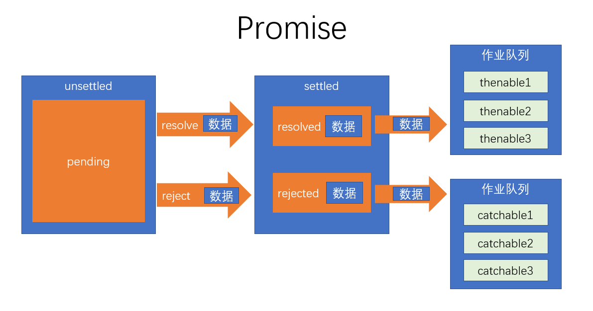

# es6
## 异步处理通用模型
ES官方参考了大量的异步场景，总结出了一套异步的通用模型，该模型可以几乎所有的异步场景，甚至是同步场景。

值得注意的是，为了兼容旧系统，es6并不打算抛弃掉过去的做法，只是基于该模型推出一个全新的api，使用api会让异步处理更加的优雅简洁。

1. es6将一件可能发生异步操作的事情分为两个阶段：**unsettled**和**settled**

- unsettled： 未决阶段，表示事情还在进行前期的处理，并没有发生通向结果的那件事
- settled：已决阶段，事情已经有了一个结果，不管这个结果是好是坏，整件事情无法逆转

事情总是从 未决阶段 逐步发展到 已决阶段的。并且，未决阶段拥有控制何时通向已决阶段的能力。

2. es6将事情划分为三种状态：**pending、resolved、rejected**

- pending: 挂起，处于未决阶段，则表示这件事情还在挂起（最终的结果还没出来）
- resolved：已处理，已决阶段的一种状态，表示整件事情已经出现结果，并是一个可以按照正常逻辑进行下去的结果
- rejected：已拒绝，已决阶段的一种状态，表示整件事情已经出现结果，并是一个无法按照正常逻辑进行下去的结果，通常用于表示有一个错误

既然未决阶段有权力决定事情的走向，因此，未决阶段可以决定事情最终的状态！

我们将 把事情变为resolved状态的过程叫做：**resolve**，推向该状态时，可能会传递一些数据

我们将 把事情变为rejected状态的过程叫做：**reject**，推向该状态时，同样可能会传递一些数据，通常为错误信息

**始终记住，无论是阶段，还是状态，是不可逆的！**


3. 当事情达到已决阶段后，通常需要进行后续处理，不同的已决状态，决定了不同的后续处理。

- resolved状态：这是一个正常的已决状态，后续处理表示为 thenable
- rejected状态：这是一个非正常的已决状态，后续处理表示为 catchable

后续处理可能有多个，因此会形成作业队列，这些后续处理会按照顺序，当状态到达后依次执行


4. 整件事称之为Promise


## Promise基本使用
```js
const pro = new Promise((resolve, reject)=>{
    // 未决阶段的处理
    // 通过调用resolve函数将Promise推向已决阶段的resolved状态
    // 通过调用reject函数将Promise推向已决阶段的rejected状态
    // resolve和reject均可以传递最多一个参数，表示推向状态的数据
})

pro.then(data=>{
    //这是thenable函数，如果当前的Promise已经是resolved状态，该函数会立即执行
    //如果当前是未决阶段，则会加入到作业队列，等待到达resolved状态后执行
    //data为状态数据
}, err=>{
    //这是catchable函数，如果当前的Promise已经是rejected状态，该函数会立即执行
    //如果当前是未决阶段，则会加入到作业队列，等待到达rejected状态后执行
    //err为状态数据
})
```
1. 未决阶段的处理函数是同步的，会立即执行
2. thenable和catchable函数是异步的，就算是立即执行，也会加入到事件队列中等待执行，并且，加入的队列是微队列
3. then可以只添加thenable函数，catch可以单独添加catchable函数
4. 在未决阶段的处理函数中，如果发生未捕获的错误，会将状态推向rejected，并会被catchable捕获
5. 一旦状态推向了已决阶段，无法再对状态做任何更改
6. **Promise并没有消除回调，只是让回调变的可控**
## Promise的链式调用
当后续的Promise需要用到之前的Promise的处理结果时，需要Promise的串联

Promise对象中，无论是then方法还是catch方法，它们都具有返回值，返回的是一个全新的Promise对象，它的状态满足下面规则
+ 如果当前的Promise是未决的，得到的新的Promise是挂起状态
+ 如果当前的Promise是已决的，会运行响应的后续处理函数，并将后续处理函数的结果（返回值）作为resolved状态数据，应用到新的Promise中；如果后续处理函数发生错误，则把返回值作为rejected状态数据，应用到新的Promise中。
**后续的Promise一定会等到前面的Promise有了后续处理结果后，才会变成已决状态**

如果前面的Promise的后续处理，返回的是一个Promise，则返回的新的Promise状态和后续处理返回的Promise状态保持一致。

```js
const pro1 = new Promise((resolve, reject) => {
    resolve(1);
})

const pro2 = new Promise((resolve, reject) => {
    setTimeout(() => {
        resolve(2);
    }, 3000);
})
pro1.then(result => {
    console.log(result) //1 pro1中resolve的参数
    console.log("结果出来了，得到的是一个Promise")
    return pro2;
}).then(result => {
    console.log(result)//2 pro2中resolve的参数
}).then(result => {
    console.log(result)//undefinded  上个then没有返回任何值
})
```
```js
  let fn = (a) =>{
           return new Promise((resolve,reject) =>{
                setTimeout(() =>{
                    console.log(a)
                  resolve(a)
                },1000)
           })
       }
       let arr = ['a','b','c','d']
    function myFor(){
        let promise;
        return function(arr,fn){
             for(let i = 0; i< arr.length ; i++){
                if(i === 0){
                    promise = fn(arr[i])
                }else{
                    promise = promise.then((r) =>{
                       return fn(arr[i])
                    })
                }
             }
        }
    }
    myFor()(arr,fn)
```


## async和await
async 和 await 是 ES2016 新增两个关键字，它们借鉴了 ES2015 中生成器在实际开发中的应用，目的是简化 Promise api 的使用，并非是替代 Promise。
### async
目的是简化在函数返回值中对Promise的创建

async用于修饰函数（无论是函数字面量还是函数表达式），放置在函数最开始的位置，被修饰函数的返回结果一定是Promise对象

```js
async function test(){
    console.log(1);
    return 2;
}
//等效于
function test(){
    return new Promise((resolve,reject) =>{
         console.log(1);
         resolve(2)
    })
}
```
### await
**await关键字必须出现在async函数中！**

await用在某个表达式之前，如果表达式是一个promise，得到的是thenable中的数据状态

```js

async function test1(){
    console.log(1);
    return 2;
}

async function test2(){
    const result = await test1();
    console.log(result);
}

test2();
```
等效于

```js

function test1(){
    return new Promise((resolve, reject)=>{
        console.log(1);
        resolve(2);
    })
}

function test2(){
    return new Promise((resolve, reject)=>{
        test1().then(data => {
            const result = data;
            console.log(result);
            resolve();
        })
    })
}

test2();

```
### 使用try catch处理错误
```js
  async function getPromise() {
            if (Math.random() < 0.5) {
                return 1;
            } else {
                throw 2;
            }
        }

        async function test() {
            try {
                const result = await getPromise();
                console.log("正常状态", result)
            } catch (err) {
                console.log("错误状态", err);
            }
        }

        test();
```
### 循环处理数据
```js
async function myForEach(arr,fn){
   for(let idx in arr){
     await fn(arr[idx],idx)
   }
}
```
```js
 let fn = (a) =>{
           return new Promise((resolve,reject) =>{
                setTimeout(() =>{
                    console.log(a)
                  resolve(a)
                },1000)
           })
       }
       let arr = ['a','b','c','d']
       async function  myFor(arr,fn){
             for(let i = 0; i < arr.length; i++){
                await fn(arr[i])
             }
       }
       myFor(arr,fn)
```

## 迭代器
### 背景知识
1. 什么是迭代
从一个数据集合中按照一定的顺序，不断取出数据的过程
2. 迭代和遍历的区别
迭代强调的是依次取数据，并不保证取多少，也不保证把所有的数据取完

遍历强调的是把整个数据依次全部取出
3. 迭代器
对迭代过程的封装，在不同的语言中有不同的表现形式，通常为对象

4. 迭代模式
一种设计模式，用于统一迭代过程，并规范了迭代器规格：

+ 迭代器应该具有得到下一个数据的能力
+ 迭代器应该具有判断是否还有后续数据的能力
### JS中的迭代器
js规定，如果一个对象具有next方法，并且该方法返回一个对象，该对象的格式如下：
```js
{value:值,done:是否迭代完成}
```
含义：
+ next方法：用于得到下一个数据
+ 返回的对象
  - value:下一个数据的值
  - done：boolean，是否迭代完成
```js
  let arr = [1,2,3,5];
      let iterator = {
          i:0,
          next(){
              let result = {
                value:arr[this.i],
                done:this.i >= arr.length
              }
              this.i ++;
              return result
          }
      }
     let data = iterator.next();
     while(!data.done){
        console.log(data.value);
        data = iterator.next();
     }
```
```js
  let arr = [1,2,4,5,6,7,8,5,4,5,6];
    function iteratorFactory(arr){
        let i = 0;
        return {
            next(){
                let r = {
                    value:arr[i],
                    done:i >= arr.length
                }
                i++;
                return r;
            }
        }
    }
    let iterator = iteratorFactory(arr);
    let data = iterator.next();
    while(!data.done){
       console.log(data.value);
       data = iterator.next();
    }
```
```js
// 依次得到斐波拉契数列前面n位的值
// 1 1 2 3 5 8 13 .....

//创建一个斐波拉契数列的迭代器
function cerateFIterator() {
    let n = 1;
    let prev1 = 1;
    let prev2 = 1;

    let result = {
        next() {
            if (n <= 2) {
                value = 1;
            } else {
                value = prev1 + prev2;
            }
            let r = {
                value: value,
                done: false
            }
            n++;
            prev1 = prev2;
            prev2 = r .value
            return r;
        }
    };

    return result;
}
let iterator = cerateFIterator();
```
**可迭代协议**

ES6规定，如果一个对象具有知名符号属性```Symbol.iterator```，并且属性值是一个迭代器创建函数，则该对象是可迭代的（iterable）
```js
  //可迭代对象
    var obj = {
        a: 1,
        b: 2,
        [Symbol.iterator]() {
            const keys = Object.keys(this);
            let i = 0;
            return {
                next: () => {
                    const propName = keys[i];
                    const propValue = this[propName];
                    const result = {
                        value: {
                            propName,
                            propValue
                        },
                        done: i >= keys.length
                    }
                    i++;
                    return result;
                }
            }
        }
    }

    for (const item of obj) {
        console.log(item); // {propName:"a", propValue:1}
    }
```

## for-of 循环

for-of 循环用于遍历可迭代对象，格式如下

```js
//迭代完成后循环结束
for(const item in iterable){
    //iterable：可迭代对象
    //item：每次迭代得到的数据
}
```

## 展开运算符与可迭代对象

展开运算符可以作用于可迭代对象，这样，就可以轻松的将可迭代对象转换为数组。
## 生成器
1. 什么是生成器

生成器是一个通过构造函数Generator创建的对象，生成器既是一个迭代器，同时又是一个可迭代对象

2. 生成器的创建，必须使用生成器函数（Generator Function）

3. 如何书写生成器函数
```js
//这是一个生成器函数，该函数一定返回一个生成器
function* method(){

}
```
4. 生成器函数内部是如何执行的？
生成器函数内部是为了给生成器的每次迭代提供数据

每次调用生成器的next方法，将导致生成器函数运行到下一个yield关键字位置

yield是一个关键字，该关键字只能在生成器函数内部使用，表达“产生”一个迭代数据

5. 有哪些需要注意的细节
+ 生成器可以有返回值，返回值出现在第一次done为true时的value属性中
+ 调用生成器的next方法时，可以传递参数，传递的参数会交给yield表达式的返回值
+ 第一次调用next方法时，传参没有任何意义
+ 在生成器函数的内部，可以调用其他生成器函数，但是要注意加上*

6. 其他api
- return方法：调用该方法，可以提前结束生成器函数，从而提前让整个迭代过程结束
- throw方法：调用该方法，可以在生成器中产生一个错误
```js
    const arr1 = [1, 2, 3, 4, 5];
    const arr2 = [6, 7, 8, 9];

    // 迭代器创建函数  iterator creator
    function* createIterator(arr) {
        for (const item of arr) {
            yield item;
        }
    }
    const iter1 = createIterator(arr1);
    const iter2 = createIterator(arr2);
```
```js
   //创建一个斐波拉契数列的迭代器
        function* createFeiboIterator() {
            let prev1 = 1,
                prev2 = 1, //当前位置的前1位和前2位
                n = 1; //当前是第几位
            while (true) {
                if (n <= 2) {
                    yield 1;
                } else {
                    const newValue = prev1 + prev2
                    yield newValue;
                    prev2 = prev1;
                    prev1 = newValue;
                }
                n++;
            }
        }
        const iterator = createFeiboIterator();
```
```js
  function* test() {
            console.log("第1次运行")
            yield 1;
            console.log("第2次运行")
            yield 2;
            console.log("第3次运行");
            return 10;
        }
    const generator = test();
```
```js
  function* test(){
             let info = yield 1;
             console.log(info);
             info = yield 2 + info;
             console.log(info);
        }
        let generator = test();
        generator.next();
        console.log(generator.next(1).value);//3 == 2 + info
```
>第一次的next执行没有意义，第二次执行next的参数会赋给第一个yield的info，第二次调用next的结果中保存了 第二次yield的 2 + info
### 生成器的应用
```js
function* task() {
    const d = yield 1;
    console.log(d)
    // //d : 1
    const resp = yield fetch("http://101.132.72.36:5100/api/local")
    const result = yield resp.json();
    console.log(result);
}
run(task)
function run(generatorFunc) {
    const generator = generatorFunc();
    let result = generator.next(); //启动任务（开始迭代）, 得到迭代数据
    handleResult();
    //对result进行处理
    function handleResult() {
        if (result.done) {
            return; //迭代完成，不处理
        }
        //迭代没有完成，分为两种情况
        //1. 迭代的数据是一个Promise
        //2. 迭代的数据是其他数据
        if (typeof result.value.then === "function") {
            //1. 迭代的数据是一个Promise
            //等待Promise完成后，再进行下一次迭代
            result.value.then(data => {
                result = generator.next(data)
                handleResult();
            })
        } else {
            //2. 迭代的数据是其他数据，直接进行下一次迭代
            result = generator.next(result.value)
            handleResult();
        }
    }
}
```


