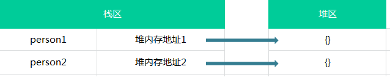

# js 基础
   ## 1 浏览器及内核
::: tip 主流浏览器
1. IE ------------------------ trident ------- '-ms-'
2. Chrome ----------------- webkit/blink------- '-webkit-'
3. firefox ------------------- Gecko ------------ '-moz-'
4. Opera ------------------- presto -------------- '-o-'
5. Safari -------------------- Webkit ------------- '-webkit-'
:::
## 2 js数据类型
### 2.1 原始数据类型
::: tip 5种原始数据类型
+ Number （原始数据类型中的基本数据类型）
   1. number类型包含整数和浮点数（浮点数数值必须包含一个小数点，且小数点后至少有一位数字）。
浮点数会自动转换为整数，如下：
    ``` js
    let a = 1.00
    console.log(a) // 输出：1，自动转换为了整数
    ```
   2. NaN：非数字类型，特点：涉及到任何关于NaN的操作，都会返回NaN，而且NaN不等于自身
   3. isNaN()函数用于判断是否是一个非数字类型，如果传入的参数是一个非数字类型，那么返回true，否则返回false；
   4. isNaN()函数传入一个参数，函数会先将参数转换为数值，如果参数类型为对象类型，会先调用对象的valueOf()方法，再确定该方 法返回的值是否可以转换为数值类型，如果不能，再调用对象的toString()方法，再确定返回值；
   5. Number()，转型函数，可以用于任何数据类型;parseInt()，将值转换为整型，用的较多;parseFloat()，将值转换为浮点型
+ Boolean（原始数据类型中的基本数据类型）
+ String  （原始数据类型中的基本数据类型）
+ undefined （原始数据类型中的特殊数据类型）
   1. 只有一个值，即undefined，如果声明了一个变量，但是未给变量初始化值，那么这个变量的值就是undefined：
   2. 调用函数时，应该提供的参数没有提供，该参数等于undefined；
   3. 对象没有赋值的属性，该属性的值为undefined；
   4. 函数没有返回值，默认返回undefined。
+ null （原始数据类型中的特殊数据类型）
  1. null类型被看做空对象指针，只有一个值，即null值，所以在用typeof操作符去检测null类型的值得时候，结果是object类型；
  2. 如果你定义了一个变量，但是想在以后把这个对象当做一个对象来使用，最好将该对象初始化为null值
 
:::
::: tip 基本数据类型的特点
1. 基本数据类型是按值访问的，我们操作的是存在变量中的实际的值；
2. 基本数据类型的值是不可变的；
``` js
let a = 'abc'
  a.toUpperCase()
  console.log(a) // 输出：abc
  let data = 'abc'
  data = 'def'
  console.log(data) // 输出：def
  //此时data中的值 ‘abc’并没有改变 只是指向了新值‘def’
```
3. 基本数据类型不可以添加属性和方法（调用基本类型的方法或者属性时，js内部会创建包装类）
4. 基本数据类型的赋值是简单的赋值（如果从一个变量向另一个变量赋值基本类型的值，会在变量对象上创建一个新值，然后把该值赋值到位新变量分配的位置上）：
``` js
let a = 'abc'
  let a = 18
  let b = a
  a++
  console.log(a) // 输出：19
  console.log(b) // 输出：18
```
5. 基本数据类型的比较是值的比较：
6. 基本类型的值在内存中占据固定大小的空间，被保存在栈内存中。（从一个变量向另一个变量复制基本类型的值，会创建这个值的一个副本）；
:::
### 2.2 引用数据类型
::: tip 引用类型特点(Array Object)
1. 引用数据类型可以拥有属性和方法，且值是可变的；
2. 引用数据类型的值是同时保存在栈内存和堆内存的对象
3. 引用类型的比较是引用的比较；

:::
### 2.3 typeof
::: tip typeof 的返回值
+ "string"
+ "number"
+ "object"
+ "undefined"
+ "boolean"
+ "function"
:::
::: tip 利用typeof返回值判断值得类型
``` js
let a = 'abc'
  
```
:::

### 2.4 es6数据类型
::: tip 1.Symbol
+ es6除了Number String Bollean Object null undefined 还新增了Symbol，它标识独一无二的值，可以用来定义对象的唯一的属性名
+ Symbol不能使用new命令，因为Symbol是原始数据类型不是对象。可以接收一个字符串作为参数，为新创建的symbol提供描述，用来显示在控制台或者做为字符串的时候使用，便于区分
   ``` js
    let a = Symbol('a');
    let b = Symbol('a');
    console.log(a) //输出 Symbol(a)
    console.log(b) ;//输出 Symbol(a)
    console.log(a === b);//输出 false
    console.log(a.toString()) //输出 'Symbol(a)'
    console.log(typeof a)//输出 'symbol'
    let obj = {};
    obj[b] = '测试';
    console.log(obj[b]);//输出 '测试'
   ```
:::
::: tip 2.Set
#### 简述
set对象允许存储任何类型的唯一值,无论是原始值或者是对象引用; set对象是值的集合,元素只会出现一次,即Set中的元素是唯一的.
 ::: warning  new Set([iterable])
 参数非必需, 如果传递一个可迭代对象,他的所有元素被添加到新的Set中,如果无此参数,则Set为空；返回一个新的Set对象
 :::
#### Set与数组之间的装换
  ``` js
    var arr = [1,2,3,4,4];
    var set = new Set(arr) //数组转换set对象
    set //{1,2,3,4}
    //方法一
    Array.from(set) //[1,2,3,4]
    //方法二
    [...set] //[1,2,3,4]
  ```
#### Set与字符串
  ``` js
    var str = 'siiva';
    new Set(str) //{'s','i','v','a'}
  ```
#### set数组去重
  ``` js
   let array = [1,2,2,3,3,4,4,5,5];
   let set = new Set(array);//{1, 2, 3, 4, 5}
   let newArray = Array.from(set) //[1, 2, 3, 4, 5]
  ```
  ``` js
   let array = [1,2,2,3,3,4,4,5,5];
   let set = new Set(array);//{1, 2, 3, 4, 5}
   let newArray = [...set] //[1, 2, 3, 4, 5]
  ```
::: tip 3.Map
#### Map 对象保存键值对。任何值(对象或者原始值) 都可以作为一个键或一个值
#### Map 和 Object
 ::: warning  区别
 + 一个 Object 的键只能是字符串或者 Symbols，但一个 Map 的键可以是任意值。
 + Map 中的键值是有序的（push进去的顺序），而添加到对象中的键则不是（他们会先排数字开头的key值，然后才是字符串开头的key值）。
 + Map 的键值对个数可以从 size 属性获取，而 Object 的键值对个数只能手动计算
 + Object对象有原型， 也就是说他有默认的key值在对象上面， 除非我们使用Object.create(null)创建一个没有原型的对象
 :::

   ## 3 js运算符
::: tip &&运算符
  #### && 碰到假就停返回当前表达式值而不是布尔值
  ::: warning  &&详细规则
  先看第一个表达式转换成布尔值的结果，如果第一个结果为真，那么它就会看第二个表达式转换成布尔值的结果。如果只有两个表达式，只要看到第二个表达式(第一个表达式的值为真)，就可以返回该表达式（第二个表达式）的值了。
  如果第一个表达式转换成布尔值的结果为fasle，直接返回第一个表达式的值。
  ``` js
   var f = 1 + 1 && 1 - 1; //f = 0
   var f = 1 - 1 && 1 + 1; //f = 0
    2 > 1 && document.write('1') //相当于if 起到中断作用
  ```
  :::
::: tip ||运算符  碰到真就停返回当前表达式值而不是布尔值
  ``` js
    var event = e || window.event; //事件兼容写法
  ```
 

:::
## 4 js数组
### Array
+ Array.from()
::: tip  从类数组对象或者可迭代对象中创建一个新的数组实例
  ``` js
    let arr = [1,2,3,44,44,44,5,5,5,5];
    let set = new Set(arr);
    let newArr = Array.from(set);
    console.log(newArr)// [1, 2, 3, 44, 5]
  ```
:::
+ Array.isArray()
::: tip  用来判断某个变量是否是一个数组对象。
  ``` js
   Array.isArray([])// true
  ```
:::
+ Array.of()
::: tip  根据一组参数来创建新的数组实例，支持任意的参数数量和类型。
  ``` js
   Array.of(1)//[1]
   Array.of({a:'1',b:'s'})//[ {a: "1", b: "s"}]
  ```
:::
### 数组修改器方法（下面的这些方法会改变调用它们的对象自身的值）
+ ### Array.prototype.copyWithin()
::: tip  arr.copyWithin(target[, start[, end]])
#### 在数组内部，将一段元素序列拷贝到另一段元素序列上，覆盖原有的值。
  ``` js
  //target 复制序列到该位置。如果是负数，target 将从末尾开始计算。
  //start 开始复制元素的起始位置。如果是负数，start 将从末尾开始计算
  //end 开始复制元素的结束位置。copyWithin 将会拷贝到该位置，
  //但不包括 end 这个位置的元素。如果是负数， end 将从末尾开始计算
  const array1 = ['a', 'b', 'c', 'd', 'e'];
// 把下标为3的复制到下标为0的开位置
console.log(array1.copyWithin(0, 3, 4));//["d", "b", "c", "d", "e"]


// copy to index 1 all elements from index 3 to the end
//把下标从3开始之后的元素复制复制到下标从1开始的位置
console.log(array1.copyWithin(1, 3));//["d", "d", "e", "d", "e"]

  ```
:::
+ ### Array.prototype.fill()
::: tip arr.fill(value[, start[, end]])
#### 将数组中指定区间的所有元素的值，都替换成某个固定的值。
  ``` js
   //value 用来填充数组元素的值。
   //start 起始索引，默认值为0。
   // end 终止索引，默认值为 this.length。
   const array1 = [1, 2, 3, 4];
   console.log(array1.fill(0, 2, 4));//[1, 2, 0, 0]
   console.log(array1.fill(5, 1));//[1, 5, 5, 5]
   console.log(array1.fill(6));//[6, 6, 6, 6]
  ```
:::

+ ### Array.prototype.pop()
::: tip  arr.pop()
#### 删除数组的最后一个元素，并返回这个元素。
  ``` js
  //pop 方法有意具有通用性。该方法和 call() 或 apply() 一起使用时，
  //可应用在类似数组的对象上。pop方法根据 length属性来确定最后一个元素的位置。
  //如果不包含length属性或length属性不能被转成一个数值，会将length置为0，
  //并返回undefined。如果你在一个空数组上调用 pop()，它返回  undefined。
  const plants = ['1', '2', '3', '4', '5'];
  console.log(plants.pop());//5
  console.log(plants);//['1', '2', '3', '4']

  
  ```
:::
+ ### Array.prototype.push()
::: tip  arr.push(element1, ..., elementN)
#### 在数组的末尾增加一个或多个元素，并返回数组的新长度。
  ``` js
  // elementN 被添加到数组末尾的元素。
  //当调用该方法时，新的 length 属性值将被返回。
const animals = ['pigs', 'goats', 'sheep'];
const count = animals.push('cows');
console.log(count);//4
console.log(animals);//["pigs", "goats", "sheep", "cows"]
  ```
:::
+ ### Array.prototype.reverse()
::: tip  arr.reverse()
#### 颠倒数组中元素的排列顺序，即原先的第一个变为最后一个，原先的最后一个变为第一个。
  ``` js
  const array1 = ['one', 'two', 'three'];
  const reversed = array1.reverse();
  console.log(reversed); //["three", "two", "one"]
  console.log(array1);//["three", "two", "one"]
  ```
:::
+ ### Array.prototype.shift()
::: tip  arr.shift()
#### 删除数组的第一个元素，并返回这个元素。
  ``` js
  //shift 方法移除索引为 0 的元素(即第一个元素)，并返回被移除的元素，其他元素的索引值随之减 1。
  //如果 length 属性的值为 0 (长度为 0)，则返回 undefined。
  const array1 = [1, 2, 3];
  const firstElement = array1.shift();
  console.log(array1);// [2, 3]
  console.log(firstElement);// 1
  ```
:::
+ ### Array.prototype.sort()
::: tip  arr.sort([compareFunction])
#### 对数组元素进行排序，并返回当前数组。
  ``` js
  //compareFunction 用来指定按某种顺序进行排列的函数。如果省略，元素按照转换为的字符串的各个字符的Unicode位点进行排序
  //compareFunction方法接收两个参数firstEl，secondEl
  //firstEl 第一个用于比较的元素
  //secondEl 第二个用于比较的元素。
  //返回排序后的数组。请注意，数组已原地排序，并且不进行复制。
  //如果指明了 compareFunction ，那么数组会按照调用该函数的返回值排序。即 a 和 b 是两个将要被比较的元素：
  //如果 compareFunction(a, b) 小于 0 ，那么 a 会被排列到 b 之前；
  //如果 compareFunction(a, b) 等于 0 ， a 和 b 的相对位置不变。
  //如果 compareFunction(a, b) 大于 0 ， b 会被排列到 a 之前。
  function compare(a, b) {
    if (a < b ) {           // 按某种排序标准进行比较, a 小于 b
      return -1;
    }
    if (a > b ) {
      return 1;
    }
    return 0;
  }
  //要比较数字而非字符串，比较函数可以简单的以 a 减 b，如下的函数将会将数组升序排列
  function compareNumbers(a, b) {
    return a - b;
  }
  //sort 方法可以使用 函数表达式 方便地书写：var numbers = [4, 2, 5, 1, 3];
numbers.sort(function(a, b) {
  return a - b;
});
console.log(numbers);
var numbers = [4, 2, 5, 1, 3]; 
numbers.sort((a, b) => a - b); 
console.log(numbers);// [1, 2, 3, 4, 5]
//对象可以按照某个属性排序：
var items = [
  { name: 'Edward', value: 21 },
  { name: 'Sharpe', value: 37 },
  { name: 'And', value: 45 },
  { name: 'The', value: -12 },
  { name: 'Magnetic' },
  { name: 'Zeros', value: 37 }
];

// sort by value
items.sort(function (a, b) {
  return (a.value - b.value)
});

// sort by name
items.sort(function(a, b) {
  var nameA = a.name.toUpperCase(); 
  var nameB = b.name.toUpperCase(); 
  if (nameA < nameB) {
    return -1;
  }
  if (nameA > nameB) {
    return 1;
  }

  
// names must be equal

  return 0;
});


  
  ```
:::
+ ### Array.prototype.splice()
::: tip  array.splice(start[, deleteCount[, item1[, item2[, ...]]]])
#### 在数组内部，将一段元素序列拷贝到另一段元素序列上，覆盖原有的值。
  ``` js
  //start 指定修改的开始位置（从0计数）。
  //整数，表示要移除的数组元素的个数。
  //item1, item2, ... 要添加进数组的元素,从start 位置开始。如果不指定，则 splice() 将只删除数组元素。
  //返回由被删除的元素组成的一个数组。如果只删除了一个元素，则返回只包含一个元素的数组。如果没有删除元素，则返回空数组

  //从第 2 位开始删除 0 个元素，插入“drum”
  var myFish = ["angel", "clown", "mandarin", "sturgeon"];
  var removed = myFish.splice(2, 0, "drum");
  console.log(myFish);//["angel", "clown", "drum", "mandarin", "sturgeon"]
  console.log(removed);//[]
  ```
:::
+ ### Array.prototype.unshift()
::: tip  arr.unshift(element1, ..., elementN)
#### 在数组的开头增加一个或多个元素，并返回数组的新长度。
  ``` js
  //elementN 要添加到数组开头的元素或多个元素
  //unshift 特意被设计成具有通用性；这个方法能够通过 call 或 apply 方法作用于类数组对象上。
  //不过对于没有 length 属性（代表从0开始的一系列连续的数字属性的最后一个）的对象，调用该方法可能没有任何意义
  //传入多个参数调用一次 unshift ，和传入一个参数调用多次 unshift (例如，循环调用)，它们将得到不同的结果
  let arr = [4,5,6];
  arr.unshift(1,2,3);
  console.log(arr); // [1, 2, 3, 4, 5, 6]

  arr = [4,5,6]; // 重置数组
  arr.unshift(1);
  arr.unshift(2);
  arr.unshift(3);
  console.log(arr); // [3, 2, 1, 4, 5, 6] 
  ```
:::
### 访问方法，不改变元素组的值，返回新值
+ ### Array.prototype.concat()
::: tip  var new_array = old_array.concat(value1[, value2[, ...[, valueN]]])
#### 返回一个由当前数组和其它若干个数组或者若干个非数组值组合而成的新数组。
  ``` js
  //将数组和/或值连接成新数组。如果省略了valueN参数参数，则concat会返回一个它所调用的已存在的数组的浅拷贝。
  //返回值为新的Array实例
  var alpha = ['a', 'b', 'c'];
  var numeric = [1, 2, 3];
  alpha.concat(numeric);//['a', 'b', 'c', 1, 2, 3]

  ```
:::
+ ### Array.prototype.includes() 
::: tip  arr.includes(valueToFind[, fromIndex])
#### 判断当前数组是否包含某指定的值，如果是返回 true，否则返回 false。
  ``` js
  //valueToFind 需要查找的元素值。
  //fromIndex 从fromIndex 索引处开始查找 valueToFind
  [1, 2, 3].includes(2);     // true
  [1, 2, 3].includes(4);     // false
  [1, 2, 3].includes(3, 3);  // false
  [1, 2, 3].includes(3, -1); // true
  [1, 2, NaN].includes(NaN); // true
  ```

:::
+ ### Array.prototype.join()
::: tip  arr.join([separator])
#### 连接所有数组元素组成一个字符串。
  ``` js
  //separator  指定一个字符串来分隔数组的每个元素
  //如果缺省该值，数组元素用逗号（,）分隔。如果separator是空字符串("")，则所有元素之间都没有任何字符
  const elements = ['Fire', 'Air', 'Water']; 
  console.log(elements.join()); //"Fire,Air,Water"
  console.log(elements.join(''));// "FireAirWater"
  console.log(elements.join('-'));//"Fire-Air-Water"
  ```
:::
+ ### Array.prototype.slice()
::: tip  arr.slice([begin[, end]])
#### 抽取当前数组中的一段元素组合成一个新数组。
  ``` js
  //slice 会提取原数组中索引从 begin 到 end 的所有元素（包含 begin，但不包含 end）。
  //返回值是一个含有被提取元素的新数组。
  var fruits = ['Banana', 'Orange', 'Lemon', 'Apple', 'Mango'];
  var citrus = fruits.slice(1, 3);
  // fruits  ['Banana', 'Orange', 'Lemon', 'Apple', 'Mango']
// citrus  ['Orange','Lemon']
  ```
:::
+ ### Array.prototype.toString()
::: tip  arr.toString()
#### 返回一个由所有数组元素组合而成的字符串。遮蔽了原型链上的Object.prototype.toString()
  ``` js
const array1 = [1, 2, 'a', '1a'];
console.log(array1.toString());// "1,2,a,1a"

  ```
:::
+ ### Array.prototype.indexOf()
::: tip  arr.indexOf(searchElement[, fromIndex])
#### 返回数组中第一个与指定值相等的元素的索引，如果找不到这样的元素，则返回 -1
  ``` js
  //searchElement 要查找的元素
  //fromIndex 开始查找的位置。
  //返回值：首个被找到的元素在数组中的索引位置; 若没有找到则返回 -1
  var array = [2, 5, 9];
  array.indexOf(2);     // 0
  array.indexOf(7);     // -1
  array.indexOf(9, 2);  // 2
  array.indexOf(2, -1); // -1
  array.indexOf(2, -3); // 0
  ```
:::
+ ### Array.prototype.lastIndexOf()
::: tip  arr.lastIndexOf(searchElement[, fromIndex])
#### 返回数组中最后一个（从右边数第一个）与指定值相等的元素的索引，如果找不到这样的元素，则返回 -1。
  ``` js
  //searchElement 被查找的元素。
  //fromIndex  从此位置开始逆向查找。
  //返回值：数组中该元素最后一次出现的索引，如未找到返回-1。
  //lastIndexOf 使用严格相等（strict equality，即 ===）比较 searchElement 和数组中的元素。
  var array = [2, 5, 9, 2];
var index = array.lastIndexOf(2);// 3
  
  ```
:::
### 迭代方法
::: danger 提示
  在下面的众多遍历方法中，有很多方法都需要指定一个回调函数作为参数。在每一个数组元素都分别执行完回调函数之前，数组的length属性会被缓存在某个地方，所以，如果你在回调函数中为当前数组添加了新的元素，那么那些新添加的元素是不会被遍历到的。此外，如果在回调函数中对当前数组进行了其它修改，比如改变某个元素的值或者删掉某个元素，那么随后的遍历操作可能会受到未预期的影响。总之，不要尝试在遍历过程中对原数组进行任何修改，虽然规范对这样的操作进行了详细的定义，但为了可读性和可维护性，请不要这样做。
:::
+ ### Array.prototype.forEach()

::: tip  arr.forEach(callback(currentValue [, index [, array]])[, thisArg])
+ callback 为数组中每个元素执行的函数，该函数接收一至三个参数：
  + currentValue 数组中正在处理的当前元素。
  + index 数组中正在处理的当前元素的索引。
  + array forEach() 方法正在操作的数组。
+ thisArg 可选参数。当执行回调函数 callback 时，用作 this 的值。
+ 如果 thisArg 参数有值，则每次 callback 函数被调用时，this 都会指向 thisArg 参数。如果省略了 thisArg 参数，或者其值为 null 或 undefined，this 则指向全局对象。按照函数观察到 this 的常用规则，callback 函数最终可观察到 this 值。
+ forEach() 遍历的范围在第一次调用 callback 前就会确定。调用 forEach 后添加到数组中的项不会被 callback 访问到。如果已经存在的值被改变，则传递给 callback 的值是 forEach() 遍历到他们那一刻的值。已删除的项不会被遍历到。如果已访问的元素在迭代时被删除了（例如使用 shift()），之后的元素将被跳过

  ::: tip  示例
    ``` js
  // 下面的例子会输出 "one", "two", "four"。
  //当到达包含值 "two" 的项时，整个数组的第一个项被移除了，
  //这导致所有剩下的项上移一个位置。因为元素 "four" 正位于在数组更前的位置
  //，所以 "three" 会被跳过。 forEach() 不会在迭代之前创建数组的副本。
    var words = ['one', 'two', 'three', 'four'];
    words.forEach(function(word) {
      console.log(word);
      if (word === 'two') {
        words.shift();
      }
    });
  // one
  // two
  // four
    ```
    ```js
  //下面的代码会创建一个给定对象的副本。 创建对象的副本有不同的方法。
  function copy(obj) {
  const copy = Object.create(Object.getPrototypeOf(obj));
  const propNames = Object.getOwnPropertyNames(obj);
      propNames.forEach(function(name) {
        const desc = Object.getOwnPropertyDescriptor(obj, name);
        Object.defineProperty(copy, name, desc);
      });
      return copy;
    }

    const obj1 = { a: 1, b: 2 };
    const obj2 = copy(obj1); // 现在 obj2 看起来和 obj1 一模一样了
    ```
    :::
+ forEach() 为每个数组元素执行一次 callback 函数；与 map() 或者 reduce() 不同的是，它总是返回 undefined 值，并且不可链式调用。
+ forEach() 被调用时，不会改变原数组，也就是调用它的数组（尽管 callback 函数在被调用时可能会改变原数组）。
   ::: danger 注意
    除了抛出异常以外，没有办法中止或跳出 forEach() 循环。如果你需要中止或跳出循环，forEach() 方法不是应当使用的工具。
     
    :::
:::  


+ ### Array.prototype.entries() 
#### 返回一个数组迭代器对象，该迭代器会包含所有数组元素的键值对。
+ 返回一个新的 Array 迭代器对象。Array Iterator是对象，它的原型（__proto__:Array Iterator）上有一个next方法，可用用于遍历迭代器取得原数组的[key,value]。
::: tip  示例
 + 1.Array Iterator
  ``` js
  var arr = ["a", "b", "c"];
  var iterator = arr.entries();
  console.log(iterator);
  /*Array Iterator {}
          __proto__:Array Iterator
          next:ƒ next()
          Symbol(Symbol.toStringTag):"Array Iterator"
          __proto__:Object
  */
  ```
  + 2.iterator.next()
  ``` js
  var arr = ["a", "b", "c"]; 
  var iterator = arr.entries();
  console.log(iterator.next());
  /*{value: Array(2), done: false}
            done:false
            value:(2) [0, "a"]
            __proto__: Object
  */
  // iterator.next()返回一个对象，对于有元素的数组，
  // 是next{ value: Array(2), done: false }；
  // next.done 用于指示迭代器是否完成：在每次迭代时进行更新而且都是false，
  // 直到迭代器结束done才是true。
  // next.value是一个["key","value"]的数组，是返回的迭代器中的元素值。
  ```
  + 3.iterator.next()使用
  ``` js
  let array = [1,2,3,4,5,6,7,8]
  let iterator = array.entries();
  let item = iterator.next();
  while(!item.done){
    console.log(item.value);
      // [0, 1]
      // [1, 2]
      // [2, 3]
      // [3, 4]
      // [4, 5]
      // [5, 6]
      // [6, 7]
      // [7, 8]
    item = iterator.next();
  }

  ```
 + 4.使用for...of
  ``` js
  var arr = ["a", "b", "c"];
  var iterator = arr.entries();
  // undefined

  for (let e of iterator) {
      console.log(e);
  }

  // [0, "a"] 
  // [1, "b"] 
  // [2, "c"]
  ```
:::
+ ### Array.prototype.some()
::: tip  提示
#### 如果数组中至少有一个元素满足测试函数，则返回 true，否则返回 false。
+ 如果用一个空数组进行测试，在任何情况下它返回的都是false。
:::
+ ### Array.prototype.every()
::: tip  arr.every(callback[, thisArg])
#### 如果数组中的每个元素都满足测试函数，则返回 true，否则返回 false
+ callback 用来测试每个元素的函数，它可以接收三个参数：
  + element 用于测试的当前值。
  + index 用于测试的当前值的索引。
  + array 调用 every 的当前数组。
+ thisArg 执行 callback 时使用的 this 值。
  ``` js
  function isBigEnough(element, index, array) {
  return element >= 10;
  }
  [12, 5, 8, 130, 44].every(isBigEnough);   // false
  [12, 54, 18, 130, 44].every(isBigEnough); // true
  [12, 5, 8, 130, 44].every(x => x >= 10); // false
  [12, 54, 18, 130, 44].every(x => x >= 10); // true
  ```
:::
+ ### Array.prototype.filter()
::: tip  提示
#### 将所有在过滤函数中返回 true 的数组元素放进一个新数组中并返回。
  ``` js
  const words = ['spray', 'limit', 'elite', 'exuberant', 'destruction', 'present'];
  const result = words.filter(word => word.length > 6);
  console.log(result);//["exuberant", "destruction", "present"]
  ```
:::
+ ### Array.prototype.find() 
::: tip  arr.find(callback[, thisArg])
#### 找到第一个满足测试函数的元素并返回那个元素的值，如果找不到，则返回 undefined。
  ``` js
  const array1 = [5, 12, 8, 130, 44];
  const found = array1.find(element => element > 10);
  console.log(found);// 12
  //如果你需要找到一个元素的位置或者一个元素是否存在于数组中，使用Array.prototype.indexOf() 
  //或 Array.prototype.includes()。
  ```
:::
+ ### Array.prototype.findIndex() 
::: tip  提示
#### 找到第一个满足测试函数的元素并返回那个元素的索引，如果找不到，则返回 -1。
  ``` js
  const array1 = [5, 12, 8, 130, 44];
  const isLargeNumber = (element) => element > 13;
  console.log(array1.findIndex(isLargeNumber));//3
  ```
:::
+ ### Array.prototype.keys() 
::: tip  arr.keys()
#### 返回一个数组迭代器对象，该迭代器会包含所有数组元素的键。
+ 返回一个新的 Array 迭代器对象。
+ 索引迭代器会包含那些没有对应元素的索引 Object.keys
  ``` js
    const array1 = ['a', 'b', 'c'];
    const iterator = array1.keys();

    for (const key of iterator) {
      console.log(key); // 0 1 2
    }
    var arr = ["a", , "c"];
    var sparseKeys = Object.keys(arr);
    var denseKeys = [...arr.keys()];
    console.log(sparseKeys); // ['0', '2']
    console.log(denseKeys);  // [0, 1, 2]
  ```
:::
+ ### Array.prototype.map() 
::: tip  var new_array = arr.map(function callback(currentValue[, index[, array]]) {// Return element for new_array }[, thisArg])
#### 返回一个由回调函数的返回值组成的新数组。
+ 返回值是 回调函数的结果组成了新数组的每一个元素。
+ map 方法会给原数组中的每个元素都按顺序调用一次  callback 函数。callback 每次执行后的返回值（包括 undefined）组合起来形成一个新数组。 callback 函数只会在有值的索引上被调用；那些从来没被赋过值或者使用 delete 删除的索引则不会被调用。
  ``` js
  // 使用 map 重新格式化数组中的对象
  var kvArray = [{key: 1, value: 10}, 
               {key: 2, value: 20}, 
               {key: 3, value: 30}];

  var reformattedArray = kvArray.map(function(obj) { 
    var rObj = {};
    rObj[obj.key] = obj.value;
    return rObj;
  });
  // reformattedArray 数组为： [{1: 10}, {2: 20}, {3: 30}], 
  // kvArray 数组未被修改: 
  // [{key: 1, value: 10}, 
  //  {key: 2, value: 20}, 
  //  {key: 3, value: 30}]

  //querySelectorAll 应用
  //下面代码展示了如何去遍历用 querySelectorAll 得到的动态对象集合。
  var elems = document.querySelectorAll('select option:checked');
  var values = Array.prototype.map.call(elems, function(obj) {
    return obj.value;
  });

  ```
:::
+ ### Array.prototype.reduce()
::: tip  提示
#### 从左到右为每个数组元素执行一次回调函数，并把上次回调函数的返回值放在一个暂存器中传给下次回调函数，并返回最后一次回调函数的返回值
  ``` js
  const array1 = [1, 2, 3, 4];
const reducer = (accumulator, currentValue) => accumulator + currentValue;
// 1 + 2 + 3 + 4
console.log(array1.reduce(reducer));//10
// 5 + 1 + 2 + 3 + 4
console.log(array1.reduce(reducer, 5));//15
  ```
+ reducer 函数接收4个参数
  + Accumulator (acc) (累计器)
  + Current Value (cur) (当前值)
  + Current Index (idx) (当前索引)
  + urce Array (src) (源数组)
+ reducer 函数的返回值分配给累计器，该返回值在数组的每个迭代中被记住，并最后成为最终的单个结果值  

```js
//数组里所有值的和
var sum = [0, 1, 2, 3].reduce(function (accumulator, currentValue) {
  return accumulator + currentValue;
}, 0);
console.log(sum)//15
```
```js
//累加对象数组里的值
var initialValue = 0;
var sum = [{x: 1}, {x:2}, {x:3}].reduce(function (accumulator, currentValue) {
    return accumulator + currentValue.x;
},initialValue)

console.log(sum) // logs 6
```
```js
//将二维数组转换为一维数组
var flattened = [[0, 1], [2, 3], [4, 5]].reduce(
  function(a, b) {
    return a.concat(b);
  },
  []
);
// flattened [0, 1, 2, 3, 4, 5]
```
```js
//计算数组中每个元素出现的次数
let array = ['aa','ss','ss','ss','sss','dd','ss','aa'];
let result = ['aa','ss','ss','ss','sss','dd','ss','aa'].reduce(function(acc,current){
      if(acc[current]){
        acc[current]++;
      }else{
        acc[current] = 1;
      }
      return acc;
},{});
console.log(result);//{aa: 2, ss: 4, sss: 1, dd: 1}
```
```js
//数组去重
let array = ['1','3','e','e','f','f','3','2'];
let result = array.reduce((acc,current)=>{
       if(acc.indexOf(current) == -1){
        acc.push(current)
       }
       return acc;
},[]);
console.log(result);
```
```js
//按属性值对object分类
var people = [{name:'蛮大人',age:20},{name:'蛮小满',age:20},{name:'蛮吉',age:5}]
function groupBy(objectArray,property){
 return objectArray.reduce(function(acc,current){
   let key = current[property];
   if(!acc[key]){
    acc[key] = [];
   }
   acc[key].push(current);
   return acc;
 },{})
}
var group = groupBy(people,'age');
console.log(group);
// { 
//   5: [{ name: '蛮吉', age: 5 }] 
//   20: [
//     { name: '蛮大人', age: 20 }, 
//     { name: '蛮小满', age: 20 }
//   ],   
// }
```
```js
//功能型函数管道
const double = x => x + x;
const triple = x => 3 * x;
const quadruple = x => 4 * x;
const pipe = (...functions) => {
  return (input) =>{
      return functions.reduce(
            (acc, fn) => {
                return fn(acc)
            },
            input
        )
  } 
};
const multiply6 = pipe(double, triple);
const multiply9 = pipe(triple, triple);
const multiply16 = pipe(quadruple, quadruple);
const multiply24 = pipe(double, triple, quadruple);
multiply6(6); // 36
multiply9(9); // 81
multiply16(16); // 256
multiply24(10); // 240
```
```js
//reduce实现map
  Array.prototype.mapUsingReduce = function(callback, thisArg) {
    return this.reduce(function(mappedArray, currentValue, index, array) {
      mappedArray[index] = callback.call(thisArg, currentValue, index, array);
      return mappedArray;
    }, []);
  };
[1, 2, , 3].mapUsingReduce(
  (currentValue, index, array) => currentValue + index + array.length
); // [5, 7, , 10]
```
:::

+ ### Array.prototype.values() 
::: tip  arr.values()
#### 返回一个数组迭代器对象，该迭代器会包含所有数组元素的值。
+ values() 方法返回一个新的 Array Iterator 对象，该对象包含数组每个索引的值
+ Array.prototype.values 是 Array.prototype[Symbol.iterator] 的默认实现。
  ``` js
  Array.prototype.values === Array.prototype[Symbol.iterator]  // true 
  let arr = ['w', 'y', 'k', 'o', 'p'];
  let eArr = arr.values();

  for (let letter of eArr) {
    console.log(letter);
  } //"a" "b" "c" "d"

  var arr = ['a', 'b', 'c', 'd', 'e'];
  var iterator = arr.values(); 
  iterator.next();               // Object { value: "a", done: false }
  iterator.next().value;         // "b"
  iterator.next()["value"];      // "c"
  iterator.next();               // Object { value: "d", done: false }
  iterator.next();               // Object { value: "e", done: false }
  iterator.next();               // Object { value: undefined, done: true } 
  iteraroe.next().value;         // undefined
  ```
:::
## 5 js数组去重
### 1.利用es6Set数据类型去重
```js
function unique(arr){
  return Array.from(new Set(arr));
}
function unique(arr){
  return [...new Set(arr)];
}
```
### 2.利用for嵌套for，然后splice去重（ES5中最常用）
```js
function unique(arr){
  for(let i = 0; i < arr.length; i++){
    for(let j = i + 1;j < arr.length; j++){
       if(arr[i] == arr[j]){
          arr.splice(j,1);
          j--;
       }
    }
  }
  return arr;
}
var arr = [1,1,'true','true',true,true,15,15,false,false, undefined,undefined, null,null, NaN, NaN,'NaN', 0, 0, 'a', 'a',{},{}];
    console.log(unique(arr))
 //[1, "true", 15, false, undefined, NaN, NaN, "NaN", "a", {…}, {…}]     //NaN和{}没有去重，两个null直接消失了(用=== null不会消失因为null == undefined为true)
```
### 3.利用indexOf去重
```js
function unique(arr){
  var result = [];
  for(let i = 0; i < arr.length; i++){
      if(result.indexOf(arr[i])){
           result.push(att[i]);
      }
  }
  return result;

}
var arr = [1,1,'true','true',true,true,15,15,false,false, undefined,undefined, null,null, NaN, NaN,'NaN', 0, 0, 'a', 'a',{},{}];
    console.log(unique(arr))
 // [1, "true", true, 15, false, undefined, null, NaN, NaN, "NaN", 0, "a", {…}, {…}]  //NaN、{}没有去重
```
### 4.利用sort
```js
function unique(arr){
arr = arr.sort()//排序之后相同的元素会放在一起
var array = [arr[0]];
for(let i = 0;i < arr.length;i++){
   if(arr[i] !== arr[i-1]){
      array.push(arr[i]);
   }
}
return array;
}
var arr = [1,1,'true','true',true,true,15,15,false,false, undefined,undefined, null,null, NaN, NaN,'NaN', 0, 0, 'a', 'a',{},{}];
console.log(unique(arr))
// [0, 1, 15, "NaN", NaN, NaN, {…}, {…}, "a", false, null, true, "true", undefined]      //NaN、{}没有去重
```
### 5.利用对象的属性不能相同的特点进行去重
```js
function unique(arr){
  var array = [];
  var obj = {};
  for(let i = 0;i < arr.length; i++){
    if(!obj[arr[i]]){
      obj[arr[i]] = 1;
      array.push(arr[i]);
    }
    return array;
  }
}
```
### 6利用includes
```js
function unique(arr){
  let array = [];
  for(let i = 0;i < arr.length; i++){
    if(!array.includes(arr[i])){
        array.push(arr[i]);
    }
  }
  return array
}
var arr = [1,1,'true','true',true,true,15,15,false,false, undefined,undefined, null,null, NaN, NaN,'NaN', 0, 0, 'a', 'a',{},{}];
    console.log(unique(arr))
    //[1, "true", true, 15, false, undefined, null, NaN, "NaN", 0, "a", {…}, {…}]     //{}没有去重
```
### 7.利用hasOwnProperty
```js
//利用hasOwnProperty判断属性是否存在
function unique(){
  let obj = {};
  return obj.hasOwnProperty(typeof item + item) ? false : (obj[typeof item + item] = true)
}
var arr = [1,1,'true','true',true,true,15,15,false,false, undefined,undefined, null,null, NaN, NaN,'NaN', 0, 0, 'a', 'a',{},{}];
 console.log(unique(arr))
//[1, "true", true, 15, false, undefined, null, NaN, "NaN", 0, "a", {…}]
 //所有的都去重了
```
### 7.利用filter
```js
function unique(){
  return arr.filter((item,index,array) =>{
    return arr.indexOf(item,0) === index;
  });
}

```
### 8利用reduce + includes
```js
function uniqur(arr){
  return arr.reduce((acc,current) =>{
    return acc.includes(current) ? acc : [...acc,current];
  },[])
}
```
## 6 js深拷贝
### 数据类型
在js中，数据类型分为基本数据类型和引用数据类型两种，对于基本数据类型来说，它的值直接储存在栈内存中，而对于引用类型来说，它在栈内存中仅仅储存了一个引用，而真正的数据存储在堆内存中
### 基本数据类型的操作
```js
var a = '蛮大人'
var b = a ;
b = '幽弥狂';
console.log(a);//蛮大人
console.log(b);//幽弥狂
```
基本数据类型的数据进行赋值操作之后，两个数据是独立的，修改b不影响a
### 引用数据类型的操作
```js
let obj1 = {
  a:"蛮大人",
  b:"海问香"
}
let obj2 = obj1;
obj2.a = "蛮小满";
console.log(obj1.a)//蛮小满
console.log(obj2.a)//蛮小满
```
可以看到两个变量的值都被修改了

对象是引用类型的值，对于引用类型来说，我们将 obj1 赋予 obj2 的时候，我们其实仅仅只是将 obj1 存储在栈堆中的的引用赋予了 obj2 ，而两个对象此时指向的是在堆内存中的同一个数据，所以当我们修改任意一个值的时候，修改的都是堆内存中的数据，而不是引用，所以只要修改了，同样引用的对象的值也自然而然的发生了改变
### JSON.stringify()以及JSON.parse()实现深拷贝
```js
let obj1 = {
  a:"a",
  b:"b",
  c:"c"
}
var json = JSON.stringify(obj1);
var obj2 = JSON.parse(json);
obj1.b = 4;
console.log(obj1.b)//4
console.log(obj2.b)//b
```
::: danger 提示
使用JSON.stringify()以及JSON.parse()它是不可以拷贝 undefined ， function， RegExp 等等类型的
:::

### Object.assign(target, source) 实现深拷贝
```js
var obj1 = {
  a:"a",
  b:"b",
  c:"c"
};
var obj2 = Object.assign({},obj1);
obj2.b = 5;
console.log(obj1.b); // a
console.log(obj2.b); // 5

```
::: danger 提示
对于一层对象来说是没有任何问题的，但是如果对象的属性对应的是其它的引用类型的话，还是只拷贝了引用，修改的话还是会有问题
:::
### 递归方式实现深拷贝
```js
function deepClone(target){
  let result;
  if(typeof target == 'object'){
    if(Array.isArray(target)){//数组
      result = [];
      for(i in target){
       result.push(deepClone(target))
      }
    }else if(target === null){
       result = null;
    }else if(target.constructor === RegExp){
       result = target;
    }else{//普通对象
      result = {};
      for(let key in target){
        result[key] = deepClone(target[key]);
      }

    }
  }else{//非对象 直接返回
    result = target;
  }
  return result;

}
```
## 7 js数据类型判断 typeof
### javascript数据类型
+ 1.Bollean
+ 2.Null
+ 3.Undefined
+ 4.Number
+ 5.String
+ 6.BigInt
+ 7.Symbol
+ 8.Object
### javascript typeof 返回值
+ "udefined" ==> Undefinde
+ "boolean" ==> Boolean
+ "number" ==> Number
+ "function" ==> Function
+ "string" ==> String
+ "symbol" ==> Symbol
+ "object" ==> Null、其他任何对象
```js
//判断数据类型
function typeOfData(param){
  let type = "";
  type = typeof param;
  let objData = {
    "[object Null]":"null",
    "[object Array]":"array",
    "[object Object]" : "object"
  }
  if(type == "object"){
    let objectType = Object.property.toString.call(param);
    type = objData[objectType]
  }
  }
```