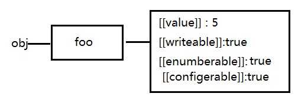
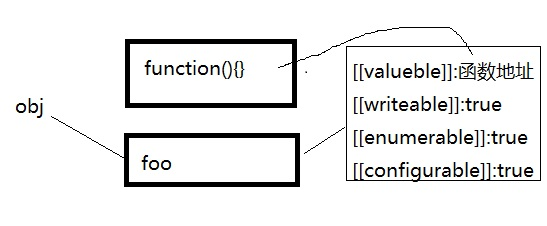

# js 基本原理
## 1 js作用域、预编译、作用域链、闭包
## 1.1js作用域
## 2 js原型、原型链、继承
## 3.1 this概述
   + 在绝大多数情况下，函数的调用方式决定了this的值。this不能在执行期间被赋值，并且在每次函数被调用时this的值也可能会不同，es5引入bind的方法来设置函数的this的值，而不用考虑函数是如何被调用的，es6引入了支持词法分析的箭头函数（它在闭合的执行环境内设置this的值）
   + javascript函数中的this并不是函数定义时候确定的，而是在函数调用的时候确定的。换句话说，函数的调用方式决定了this的指向。
## 3.1.1 this全局环境
+ 无论是否在严格模式下，在全局执行环境中（在任何函数体外部）this 都指向全局对象。
``` js
  // 在浏览器中, window 对象同时也是全局对象：
console.log(this === window); // true

a = '蛮大人';
console.log(window.a); // 蛮大人

this.b = "mdr";
console.log(window.b)  // "mdr"
console.log(b)         // "mdr"
```
::: danger 提示
你可以使用 globalThis 获取全局对象，无论你的代码是否在当前上下文运行。
:::

## 3.1.2 this函数（运行内）环境
::: tip 提示
在函数内部，this的值取决于函数被调用的方式。
:::
### 1) 简单调用(直接调用)
+ 在非严格模式下，函数没有被任何对象调用，所以this默认指向全局对象
``` js
function f1(){
  return this;
}
//在浏览器中：
f1() === window;   //在浏览器中，全局对象是window

//在Node中：
f1() === global;  
```
+ 在严格模式下，如果 this 没有被执行环境（execution context）定义，那它将保持为 undefined;this的确应该是undefined，因为f2是被直接调用的，而不是作为对象的属性或方法调用的（如 window.f2()）
``` js
function f2(){
  "use strict"; // 这里是严格模式
  return this;
}

f2() === undefined; // true 
```
+ 如果要想把 this 的值从一个环境传到另一个，就要用 call 或者apply 方法。
```js
// 将一个对象作为call和apply的第一个参数，this会被绑定到这个对象。
var obj = {a: 'Custom'};

// 这个属性是在global对象定义的。
var a = 'Global';

function whatsThis(arg) {
  return this.a;  // this的值取决于函数的调用方式
}

whatsThis();          // 'Global'
whatsThis.call(obj);  // 'Custom'
whatsThis.apply(obj); // 'Custom'
```
+ 当一个函数在其主体中使用 this 关键字时，可以通过使用函数继承自Function.prototype 的 call 或 apply 方法将 this 值绑定到调用中的特定对象。
```js
function add(c, d) {
  return this.a + this.b + c + d;
}

var o = {a: 1, b: 3};

// 第一个参数是作为‘this’使用的对象
// 后续参数作为参数传递给函数调用
add.call(o, 5, 7); // 1 + 3 + 5 + 7 = 16

// 第一个参数也是作为‘this’使用的对象
// 第二个参数是一个数组，数组里的元素用作函数调用中的参数
add.apply(o, [10, 20]); // 1 + 3 + 10 + 20 = 34
```
::: danger 提示
使用 call 和 apply 函数的时候要注意，如果传递给 this 的值不是一个对象，JavaScript 会尝试使用内部 ToObject 操作将其转换为对象。因此，如果传递的值是一个原始值比如 7 或 'foo'，那么就会使用相关构造函数将它转换为对象，所以原始值 7 会被转换为对象，像 new Number(7) 这样，而字符串 'foo' 转化成 new String('foo') 这样，例如：
```js
function bar() {
  console.log(Object.prototype.toString.call(this));
}

//原始值 7 被隐式转换为对象
bar.call(7); // [object Number]
bar.call('foo'); // [object String]
```
:::
### 2) bind调用
+ ECMAScript 5 引入了 Function.prototype.bind()。调用f.bind(someObject)会创建一个与f具有相同函数体和作用域的函数，但是在这个新函数中，this将永久地被绑定到了bind的第一个参数，无论这个函数是如何被调用的
```js
function f(){
  return this.a;
}

var g = f.bind({a:"azerty"});
console.log(g()); // azerty

var h = g.bind({a:'yoo'}); // bind只生效一次！
console.log(h()); // azerty

var o = {a:37, f:f, g:g, h:h};
console.log(o.a, o.f(), o.g(), o.h()); // 37, 37, azerty, azerty
```
### 3) 箭头函数
+ 在箭头函数中，this与封闭词法环境的this保持一致。在全局代码中，它将被设置为全局对象：
```js
var globalObject = this;
var foo = (() => this);
console.log(foo() === globalObject); // true
// 作为对象的一个方法调用
var obj = {foo: foo};
console.log(obj.foo() === globalObject); // true

// 尝试使用call来设定this
console.log(foo.call(obj) === globalObject); // true

// 尝试使用bind来设定this
foo = foo.bind(obj);
console.log(foo() === globalObject); // true
```
::: danger 提示
注意：如果将this传递给call、bind、或者apply，它将被忽略。不过你仍然可以为调用添加参数，不过第一个参数（thisArg）应该设置为null。
:::
+ 无论如何，foo 的 this 被设置为他被创建时的环境（在上面的例子中，就是全局对象）。这同样适用于在其他函数内创建的箭头函数：这些箭头函数的this被设置为封闭的词法环境的。
```js
// 创建一个含有bar方法的obj对象，
// bar返回一个函数，
// 这个函数返回this，
// 这个返回的函数是以箭头函数创建的，
// 所以它的this被永久绑定到了它外层函数的this。
// bar的值可以在调用中设置，这反过来又设置了返回函数的值。
var obj = {
  bar: function() {
    var x = (() => this);
    return x;
  }
};

// 作为obj对象的一个方法来调用bar，把它的this绑定到obj。
// 将返回的函数的引用赋值给fn。
var fn = obj.bar();

// 直接调用fn而不设置this，
// 通常(即不使用箭头函数的情况)默认为全局对象
// 若在严格模式则为undefined
console.log(fn() === obj); // true

// 但是注意，如果你只是引用obj的方法，
// 而没有调用它
var fn2 = obj.bar;
// 那么调用箭头函数后，this指向window，因为它从 bar 继承了this。
console.log(fn2()() == window); // true
```
### 4) 作为对象的方法
+ 当函数作为对象里的方法被调用时，它们的 this 是调用该函数的对象。
### 5) 原型链中的 this
+ 对于在对象原型链上某处定义的方法。如果该方法存在于一个对象的原型链上，那么this指向的是调用这个方法的对象，就像该方法在对象上一样。
```js
var o = {
  f: function() { 
    return this.a + this.b; 
  }
};
var p = Object.create(o);
p.a = 1;
p.b = 4;

console.log(p.f()); // 5
```
::: danger 提示
在这个例子中，对象p没有属于它自己的f属性，它的f属性继承自它的原型。虽然在对 f 的查找过程中，最终是在 o 中找到 f 属性的，这并没有关系；查找过程首先从 p.f 的引用开始，所以函数中的 this 指向p。也就是说，因为f是作为p的方法调用的，所以它的this指向了p。这是 JavaScript 的原型继承中的一个有趣的特性。
:::
### 6) getter 与 setter 中的 this
+ 相同的概念也适用于当函数在一个 getter 或者 setter 中被调用。用作 getter 或 setter 的函数都会把 this 绑定到设置或获取属性的对象。
```js
function sum() {
  return this.a + this.b + this.c;
}

var o = {
  a: 1,
  b: 2,
  c: 3,
  get average() {
    return (this.a + this.b + this.c) / 3;
  }
};

Object.defineProperty(o, 'sum', {
    get: sum, enumerable: true, configurable: true});

console.log(o.average, o.sum); // logs 2, 6
```
### 7) 构造函数
+ 当一个函数用作构造函数时（使用new关键字），它的this被绑定到正在构造的新对象。
```js
/*
 * 构造函数这样工作:
 *
 * function MyConstructor(){
 *   // 函数实体写在这里
 *   // 根据需要在this上创建属性，然后赋值给它们，比如：
 *   this.fum = "nom";
 *   // 等等...
 *
 *   // 如果函数具有返回对象的return语句，
 *   // 则该对象将是 new 表达式的结果。 
 *   // 否则，表达式的结果是当前绑定到 this 的对象。
 *   //（即通常看到的常见情况）。
 * }
 */

function C(){
  this.a = 37;
}

var o = new C();
console.log(o.a); // logs 37


function C2(){
  this.a = 37;
  return {a:38};
}

o = new C2();
console.log(o.a); // logs 38

```
::: danger 提示
虽然构造器返回的默认值是this所指的那个对象，但它仍可以手动返回其他的对象（如果返回值不是一个对象，则返回this对象）。
在刚刚的例子中（C2），因为在调用构造函数的过程中，手动的设置了返回对象，与this绑定的默认对象被丢弃了。（这基本上使得语句 “this.a = 37;”成了“僵尸”代码，实际上并不是真正的“僵尸”，这条语句执行了，但是对于外部没有任何影响，因此完全可以忽略它）。
:::

## 3.2 javascript this的原理（阮一峰版）
   #### （1）问题的由来
``` js
    var obj = {
    foo: function () { console.log(this.bar) },
    bar: 1
    };
    var foo = obj.foo;
    var bar = 2;

    obj.foo() // 1
    foo() // 2
```
::: danger 提示
obj.foo()就是在obj环境执行，this指向obj，而一旦var foo = obj.foo，foo()就变成在全局环境执行this执行window；why？
:::
#### （2）内存的数据结构
+ JavaScript 语言之所以有this的设计，跟内存里面的数据结构有关系。
``` js
var obj = { foo:  5 };
```
::: danger 提示
上面的代码将一个对象赋值给变量obj。JavaScript 引擎会先在内存里面，生成一个对象{ foo: 5 }，然后把这个对象的内存地址赋值给变量obj。


也就是说，变量obj是一个地址（reference）。后面如果要读取obj.foo，引擎先从obj拿到内存地址，然后再从该地址读出原始的对象，返回它的foo属性。
原始的对象以字典结构保存，每一个属性名都对应一个属性描述对象。举例来说，上面例子的foo属性，实际上是以下面的形式保存的。



``` js
{
  foo: {
    [[value]]: 5
    [[writable]]: true
    [[enumerable]]: true
    [[configurable]]: true
  }
}
```
注意，foo属性的值保存在属性描述对象的value属性里面。


:::
#### （3）函数   
``` js
  var obj = {
    foo:function(){}
  }
``` 
::: danger 提示
 这样的结构是很清晰的，问题在于属性的值可能是一个函数 如上所示；这时，引擎会将函数单独保存在内存中，然后再将函数的地址赋值给foo属性的value属性。

 
:::
``` js
  {
  foo: {
    [[value]]: 函数的地址
    ...
  }
}
``` 
由于函数是一个单独的值，所以它可以在不同的环境（上下文）执行。

``` js
  var f = function () {};
  var obj = { f: f };
  // 单独执行
  f()
  // obj 环境执行
  obj.f()
```

#### （4）环境变量 
+ JavaScript 允许在函数体内部，引用当前环境的其他变量。

``` js
var f = function () {
  console.log(x);
};
``` 
::: danger 提示
+ 上面代码中，函数体里面使用了变量x。该变量由运行环境提供。
+ 现在问题就来了，由于函数可以在不同的运行环境执行，所以需要有一种机制，能够在函数体内部获得当前的运行环境（context）。所以，this就出现了，它的设计目的就是在函数体内部，指代函数当前的运行环境。
:::
``` js
var f = function () {
  console.log(this.x);
}
``` 
::: danger 提示
+ 上面代码中，函数体里面的this.x就是指当前运行环境的x。
:::
``` js

var f = function () {
  console.log(this.x);
}

var x = 1;
var obj = {
  f: f,
  x: 2,
};

// 单独执行
f() // 1

// obj 环境执行
obj.f() // 2onsole.log(this.x);
}
``` 
::: danger 提示
+ 上面代码中，函数f在全局环境执行，this.x指向全局环境的x。
+ 在obj环境执行，this.x指向obj.x。
+ 回到本文开头提出的问题，obj.foo()是通过obj找到foo，所以就是在obj环境执行。一旦var foo = obj.foo，变量foo就直接指向函数本身，所以foo()就变成在全局环境执行。
:::
## 3.3 js this 之 call
### call方法用来执行方法并且改变方法内的this，第一个参数是新的this，后面参数为方法的参数，用逗号隔开
```js
//                                   新的this   其他参数
Function.prototype.myCall = function(content,...args){
  let fn = this;
  let new_this = content || window;
  new_this.fn = fn;
  return new_this.fn(...args);
  let obj = {
    name:"蛮大人"
}
let fn = function(){
    console.log(this.name);//蛮大人
}
fn.myCall(obj)
}
```
## 3.4 js this 之 apply
### apply方法用来执行方法并且改变方法内的this，第一个参数是新的this，后面的参数为一个数组
```js
Function.prototype.myApply = function(content,...args){
  let fn = this;
  let newthis = content || window;
  let arg = args && args[0] || [];
  newthis.fn = fn;
  return newthis.fn(...arg);
}
let obj = {
    name:"蛮大人"
}
let fn = function(a){
    console.log(this.name+a);//蛮大人12
}
fn.myApply(obj,['12'])
```
## 3.5 js this 之 bind
### bind
```js
Function.prototype.myBind = function(target,...args){
   let newthis = target;
   let fn = this;
   let arg = args || [];
   function newFn(){
      let newArgs = Array.prototype.slice.call(arguments,0);
      let allArgs = arg.concat(newArgs);
      return fn.apply(newthis,allArgs)
   }
   newFn.prototype = Object.create(fn);
   return newFn;
} 
let obj = {
    name:'蛮大人'
}
let fn = function(a,b){
    console.log(this.name + a+ b);//蛮大人bind第二参
}
let newFn = fn.myBind(obj,'bind');
newFn('第二参');
```
## 4 页面加载
       
## 5 Event Loop
