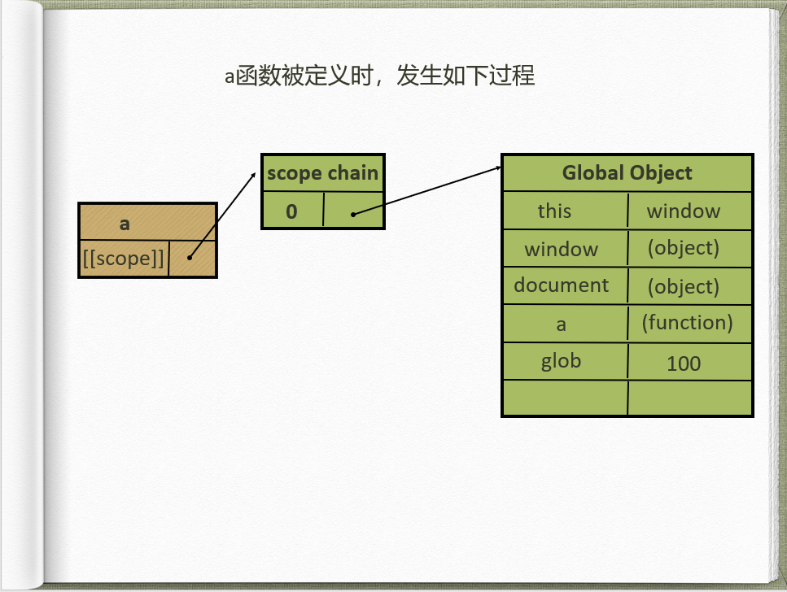
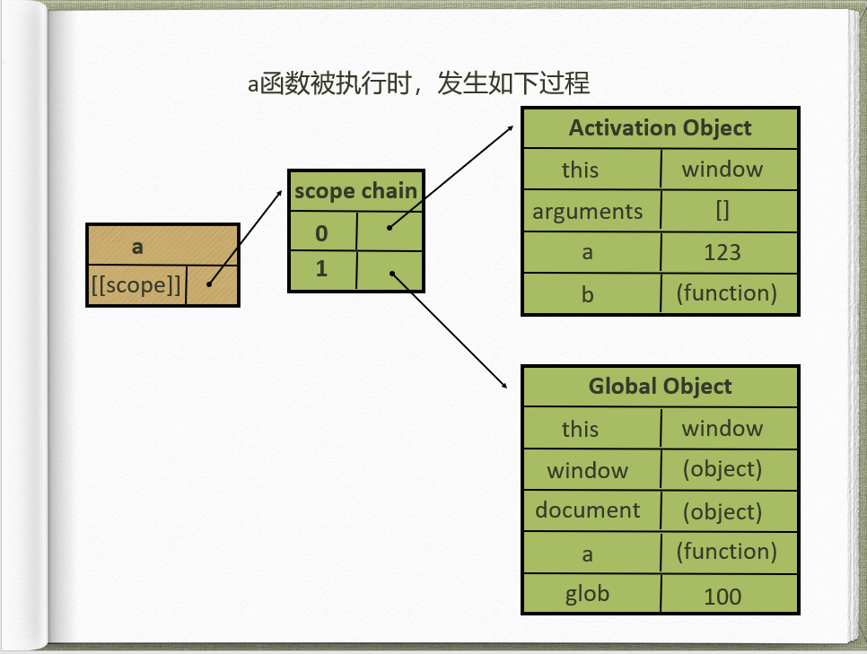
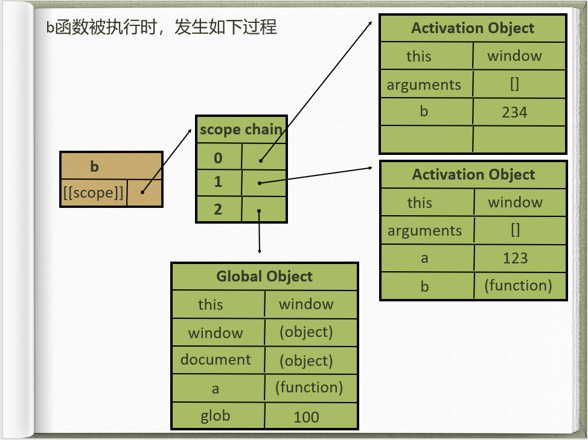
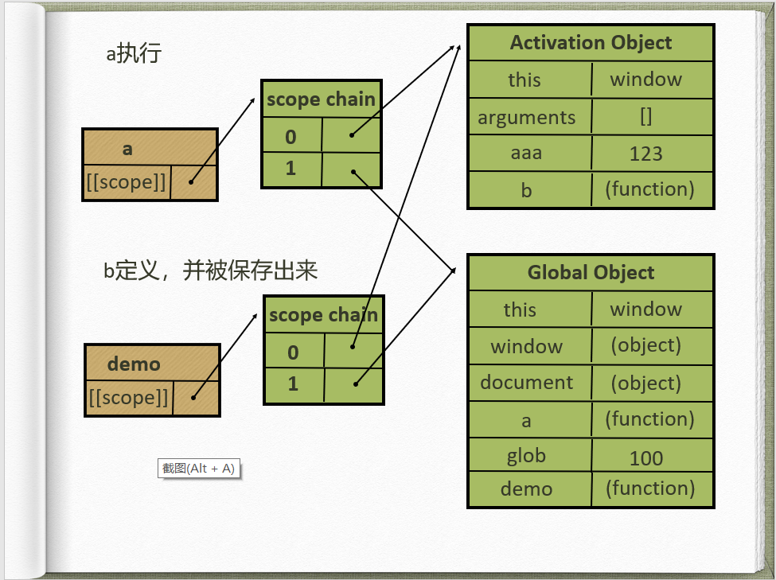
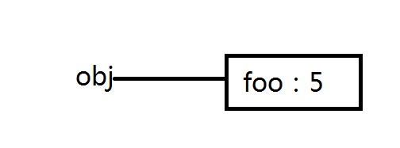

# js 基本原理
## 预编译
### js运行三部曲
1. 语法分析
2. 预编译
3. 解释执行
### 预编译产生的现象

函数 整体提升（提升为赋值为函数的值），变量 声明提升（提升赋值为undefinded）
```js
console.log(a)//undefinded
console.log(test)//function(){}
function test(){}
var a = 1;
```
>test是函数的整体提升，提升后可以访问到函数的值，a是变量的声明提升，提升后值为undefinded

### imply global 暗示全局变量

即任何变量，如果变量未经声明就赋值，此变量就为全局对象所有。

### 一切声明的全局变量，全是window的属性
window就是全局的域

var a = 123; ===> window.a = 123;
```js
function test(){
  var a = b = 2;//给b赋值过程中是赋值给了全局的b，因为它没有经过声明
}
window.b //2
```
### 预编译过程（四部曲）
预编译发生在函数执行的前一刻
+ 1.创建AO对象（执行期上下文）
+ 2.找行参和变量声明，将将变量和形参名作为AO属性名，值为undefined
+ 3.行参和实参相统一
+ 4.在函数体里面找函数声明，值赋予函数体
```js
function fn(a){
  console.log(a);//function a
  var a = 123;
  console.log(a); //123
  function a () {};//这句代码预编译时看过，解释执行时不再看
  console.log(a);//123
  console.log(b);//undefinded
  var  b =  function () {};
  console.log(b);//function b
  console.log(d);//function d
  function d () {};
}
fn(1)
```
## js作用域、作用域链
### [[scope]]:
每个javascript函数都是一个对象，对象中有些属性我们可以访问，但有些不可以，这些属性仅供javascript引擎存取，\[scope]]就是其中一个。\[[scope]]指的就是我们所说的作用域,其中存储了运行期上下文的集合。
```js
function a(){
}
//a函数定义时作用于产生 ，scope的第0位指向的是全局活动对象GO（全局执行期上下文）
//a.[[scope]] ===> 0: GO{}
var glob = 100;
a();
//a执行
//产生a的AO活动对象（a的执行期上下文）
//a.[[scope]] ===> 0: AO{}
//                 1: GO{}
```
### 作用域链
\[[scope]]中所存储的执行期上下文对象的集合，这个集合呈链式链接，我们把这种链式链接叫做作用域链。
```js
function a(){
  function b(){
    var b = 1231;
  }
  var a = 1;
  b();
}
var glob = 100;
a();
```
>函数被定义时候会产生scope，这个scope的初始值是当前它所在的执行环境的scope的值

>a定义产生a.scope:[{GO对象}]，a执行（前一刻）a.scope:[{AO对象a}，{GO对象}]，a执行到b的定义
b.scope:[{AO对象a}，{GO对象}]，，b执行（前一刻）b.scope:[{AO对象b}，{AO对象a}，{GO对象}]





### 执行期上下文
当函数执行时，会创建一个称为执行期上下文的内部对象。一个执行期上下文定义了一个函数执行时的环境，函数每次执行时对应的执行上下文都是独一无二的，所以多次调用一个函数会导致创建多个执行上下文，当函数执行完毕，执行上下文被销毁。
>上述例子中，例如，b被执行后，b自己的执行期上下文会被销毁，b回到定义的状态即b.scope:[{AO对象a}，{GO对象}]，当a执行完毕后，a的执行上下文被销毁即a.scope:[{GO对象}]，由于被销毁的a的执行期上下文中有b函数，所以b函数此时也被销毁了。不管是a还是执行完后回到被定义状态等待下次被执行，一旦被执行就会重新生成执行期上下会放在scope的顶端

### 变量查找
从作用域链的顶端依次向下查找。
## 闭包
当内部函数被保存到外部时，将会生成闭包。闭包会导致原有作用域链不释放。
```js
function a (){
  function b(){
    var bbb = 234;
    console.log(aaa);
  }
  var aaa = 123;
  return b;
}
var glob = 100;
var demo = a();
demo();
```

>上述代码a执行后，a的执行上下文会被销毁，a的scope第0位的那条线会断掉，但是，由于b被保存到了demo， a的执行期上下文却被demo存在了demo的scope的第0位。
## js原型、原型链
### 原型
原型是function对象的一个属性prototype，它定义了构造函数制造出的对象的公共祖先。通过该构造函数产生的对象，可以继承该原型的属性和方法。原型也是对象
### 原型的特点
+ 利用原型特点和概念，可以提取共有属性
+ 对象属性的增删和原型上属性增删改查
```js
function Person(name){
  this.name = name;
}
Person.prototype = {
  name:"a"
}
let person = new Person("b");
person.a // b
```
+ constructor
constructor是构造函数的prototype的属性，值为构造函数本身
+ __proto__属性

\__proto__：Function.prototype

对象的属性取值时会先找自己身上的如果没有会沿着__proto__找到构造函数的prototype

\__proto__属性是可以被修改的
```js
Person.prototype.name = "a"
function Person(){
}
Person.prototype.name = "b";
let person = new Person();
console.log(person.name) // b
```
>由于__proto__指向的时Person.prototype的地址，当Person.prototype的值本身发生变化，影响到了\__proto__
```js
Person.prototype.name = "a"
function Person(){
}
Person.prototype = {
name:"b"
};
let person = new Person();
console.log(person.name) // a
```
>由于\__proto__指向的时Person.prototype的值的地址，相当于它们两个同时指向了一个对象的地址，当Person.prototype被重新赋值后，仅仅是Person.prototype指向了新对象的地址，而\__proto__指向的还是老对象的地址
### 原型链
当我们访问对象的属性时，对先在自身上找，如果找不到会沿着\__proto__找到它的构造函数的prototype,如果上没有，又会沿着prototype对象的\__proto__找到它（prototype）的构造函数的的prototype

对象的最终都会继承自Object.prototype

## new 操作
1. 创建一个空对象
2. 让空对象的_proto_（IE没有该属性）成员指向了构造函数的prototype成员对象
3. 使用apply调用构造器函数，属性和方法被添加到 this 引用的对象中
4. 如果构造函数中没有返回其它对象，那么返回 this，即创建的这个的新对象，否则，返回构造函数中返回的对象
```js
function _new() {
    let obj= {}; // 创建的新对象
    // 第一个参数是构造函数
    let [constructor, ...args] = [...arguments];

    // 执行 [[原型]] 连接 ;实际上就是生产了一个新的上下文
    obj.__proto__ = constructor.prototype;

    // 使用apply在obj作用域中调用构造器函数，属性和方法被添加到 this 引用的对象即obj中
    let result = constructor.apply(obj, args);
    if (result && (typeof (result) == "object" || typeof (result) == "function")) {
        // 如果构造函数执行的结果返回的是一个对象，那么返回这个对象
        return result;
    }
    // 如果构造函数返回的不是一个对象，返回创建的新对象
    return obj;
}
```
## this概述
   + 在绝大多数情况下，函数的调用方式决定了this的值。this不能在执行期间被赋值，并且在每次函数被调用时this的值也可能会不同，es5引入bind的方法来设置函数的this的值，而不用考虑函数是如何被调用的，es6引入了支持词法分析的箭头函数（它在闭合的执行环境内设置this的值）
   + javascript函数中的this并不是函数定义时候确定的，而是在函数调用的时候确定的。换句话说，函数的调用方式决定了this的指向。
## this全局环境
+ 无论是否在严格模式下，在全局执行环境中（在任何函数体外部）this 都指向全局对象。
``` js
  // 在浏览器中, window 对象同时也是全局对象：
console.log(this === window); // true

a = '蛮大人';
console.log(window.a); // 蛮大人

this.b = "mdr";
console.log(window.b)  // "mdr"
console.log(b)         // "mdr"
```
::: danger 提示
你可以使用 globalThis 获取全局对象，无论你的代码是否在当前上下文运行。
:::

## this函数（运行内）环境
::: tip 提示
在函数内部，this的值取决于函数被调用的方式。
:::
### 1) 简单调用(直接调用)
+ 在非严格模式下，函数没有被任何对象调用，所以this默认指向全局对象
``` js
function f1(){
  return this;
}
//在浏览器中：
f1() === window;   //在浏览器中，全局对象是window

//在Node中：
f1() === global;  
```
+ 在严格模式下，如果 this 没有被执行环境（execution context）定义，那它将保持为 undefined;this的确应该是undefined，因为f2是被直接调用的，而不是作为对象的属性或方法调用的（如 window.f2()）
``` js
function f2(){
  "use strict"; // 这里是严格模式
  return this;
}

f2() === undefined; // true 
```
+ 如果要想把 this 的值从一个环境传到另一个，就要用 call 或者apply 方法。
```js
// 将一个对象作为call和apply的第一个参数，this会被绑定到这个对象。
var obj = {a: 'Custom'};

// 这个属性是在global对象定义的。
var a = 'Global';

function whatsThis(arg) {
  return this.a;  // this的值取决于函数的调用方式
}

whatsThis();          // 'Global'
whatsThis.call(obj);  // 'Custom'
whatsThis.apply(obj); // 'Custom'
```
+ 当一个函数在其主体中使用 this 关键字时，可以通过使用函数继承自Function.prototype 的 call 或 apply 方法将 this 值绑定到调用中的特定对象。
```js
function add(c, d) {
  return this.a + this.b + c + d;
}

var o = {a: 1, b: 3};

// 第一个参数是作为‘this’使用的对象
// 后续参数作为参数传递给函数调用
add.call(o, 5, 7); // 1 + 3 + 5 + 7 = 16

// 第一个参数也是作为‘this’使用的对象
// 第二个参数是一个数组，数组里的元素用作函数调用中的参数
add.apply(o, [10, 20]); // 1 + 3 + 10 + 20 = 34
```
::: danger 提示
使用 call 和 apply 函数的时候要注意，如果传递给 this 的值不是一个对象，JavaScript 会尝试使用内部 ToObject 操作将其转换为对象。因此，如果传递的值是一个原始值比如 7 或 'foo'，那么就会使用相关构造函数将它转换为对象，所以原始值 7 会被转换为对象，像 new Number(7) 这样，而字符串 'foo' 转化成 new String('foo') 这样，例如：
```js
function bar() {
  console.log(Object.prototype.toString.call(this));
}

//原始值 7 被隐式转换为对象
bar.call(7); // [object Number]
bar.call('foo'); // [object String]
```
:::
### 2) bind调用
+ ECMAScript 5 引入了 Function.prototype.bind()。调用f.bind(someObject)会创建一个与f具有相同函数体和作用域的函数，但是在这个新函数中，this将永久地被绑定到了bind的第一个参数，无论这个函数是如何被调用的
```js
function f(){
  return this.a;
}

var g = f.bind({a:"azerty"});
console.log(g()); // azerty

var h = g.bind({a:'yoo'}); // bind只生效一次！
console.log(h()); // azerty

var o = {a:37, f:f, g:g, h:h};
console.log(o.a, o.f(), o.g(), o.h()); // 37, 37, azerty, azerty
```
### 3) 箭头函数
+ 在箭头函数中，this与封闭词法环境的this保持一致。在全局代码中，它将被设置为全局对象：
```js
var globalObject = this;
var foo = (() => this);
console.log(foo() === globalObject); // true
// 作为对象的一个方法调用
var obj = {foo: foo};
console.log(obj.foo() === globalObject); // true

// 尝试使用call来设定this
console.log(foo.call(obj) === globalObject); // true

// 尝试使用bind来设定this
foo = foo.bind(obj);
console.log(foo() === globalObject); // true
```
::: danger 提示
注意：如果将this传递给call、bind、或者apply，它将被忽略。不过你仍然可以为调用添加参数，不过第一个参数（thisArg）应该设置为null。
:::
+ 无论如何，foo 的 this 被设置为他被创建时的环境（在上面的例子中，就是全局对象）。这同样适用于在其他函数内创建的箭头函数：这些箭头函数的this被设置为封闭的词法环境的。
```js
// 创建一个含有bar方法的obj对象，
// bar返回一个函数，
// 这个函数返回this，
// 这个返回的函数是以箭头函数创建的，
// 所以它的this被永久绑定到了它外层函数的this。
// bar的值可以在调用中设置，这反过来又设置了返回函数的值。
var obj = {
  bar: function() {
    var x = (() => this);
    return x;
  }
};

// 作为obj对象的一个方法来调用bar，把它的this绑定到obj。
// 将返回的函数的引用赋值给fn。
var fn = obj.bar();

// 直接调用fn而不设置this，
// 通常(即不使用箭头函数的情况)默认为全局对象
// 若在严格模式则为undefined
console.log(fn() === obj); // true

// 但是注意，如果你只是引用obj的方法，
// 而没有调用它
var fn2 = obj.bar;
// 那么调用箭头函数后，this指向window，因为它从 bar 继承了this。
console.log(fn2()() == window); // true
```
### 4) 作为对象的方法
+ 当函数作为对象里的方法被调用时，它们的 this 是调用该函数的对象。
### 5) 原型链中的 this
+ 对于在对象原型链上某处定义的方法。如果该方法存在于一个对象的原型链上，那么this指向的是调用这个方法的对象，就像该方法在对象上一样。
```js
var o = {
  f: function() { 
    return this.a + this.b; 
  }
};
var p = Object.create(o);
p.a = 1;
p.b = 4;

console.log(p.f()); // 5
```
::: danger 提示
在这个例子中，对象p没有属于它自己的f属性，它的f属性继承自它的原型。虽然在对 f 的查找过程中，最终是在 o 中找到 f 属性的，这并没有关系；查找过程首先从 p.f 的引用开始，所以函数中的 this 指向p。也就是说，因为f是作为p的方法调用的，所以它的this指向了p。这是 JavaScript 的原型继承中的一个有趣的特性。
:::
### 6) getter 与 setter 中的 this
+ 相同的概念也适用于当函数在一个 getter 或者 setter 中被调用。用作 getter 或 setter 的函数都会把 this 绑定到设置或获取属性的对象。
```js
function sum() {
  return this.a + this.b + this.c;
}

var o = {
  a: 1,
  b: 2,
  c: 3,
  get average() {
    return (this.a + this.b + this.c) / 3;
  }
};

Object.defineProperty(o, 'sum', {
    get: sum, enumerable: true, configurable: true});

console.log(o.average, o.sum); // logs 2, 6
```
### 7) 构造函数
+ 当一个函数用作构造函数时（使用new关键字），它的this被绑定到正在构造的新对象。
```js
/*
 * 构造函数这样工作:
 *
 * function MyConstructor(){
 *   // 函数实体写在这里
 *   // 根据需要在this上创建属性，然后赋值给它们，比如：
 *   this.fum = "nom";
 *   // 等等...
 *
 *   // 如果函数具有返回对象的return语句，
 *   // 则该对象将是 new 表达式的结果。 
 *   // 否则，表达式的结果是当前绑定到 this 的对象。
 *   //（即通常看到的常见情况）。
 * }
 */

function C(){
  this.a = 37;
}

var o = new C();
console.log(o.a); // logs 37


function C2(){
  this.a = 37;
  return {a:38};
}

o = new C2();
console.log(o.a); // logs 38

```
::: danger 提示
虽然构造器返回的默认值是this所指的那个对象，但它仍可以手动返回其他的对象（如果返回值不是一个对象，则返回this对象）。
在刚刚的例子中（C2），因为在调用构造函数的过程中，手动的设置了返回对象，与this绑定的默认对象被丢弃了。（这基本上使得语句 “this.a = 37;”成了“僵尸”代码，实际上并不是真正的“僵尸”，这条语句执行了，但是对于外部没有任何影响，因此完全可以忽略它）。
:::

## javascript this的原理（阮一峰版）
   #### （1）问题的由来
``` js
    var obj = {
    foo: function () { console.log(this.bar) },
    bar: 1
    };
    var foo = obj.foo;
    var bar = 2;

    obj.foo() // 1
    foo() // 2
```
::: danger 提示
obj.foo()就是在obj环境执行，this指向obj，而一旦var foo = obj.foo，foo()就变成在全局环境执行this执行window；why？
:::
#### （2）内存的数据结构
+ JavaScript 语言之所以有this的设计，跟内存里面的数据结构有关系。
``` js
var obj = { foo:  5 };
```
::: danger 提示
上面的代码将一个对象赋值给变量obj。JavaScript 引擎会先在内存里面，生成一个对象{ foo: 5 }，然后把这个对象的内存地址赋值给变量obj。


也就是说，变量obj是一个地址（reference）。后面如果要读取obj.foo，引擎先从obj拿到内存地址，然后再从该地址读出原始的对象，返回它的foo属性。
原始的对象以字典结构保存，每一个属性名都对应一个属性描述对象。举例来说，上面例子的foo属性，实际上是以下面的形式保存的。


``` js
{
  foo: {
    [[value]]: 5
    [[writable]]: true
    [[enumerable]]: true
    [[configurable]]: true
  }
}
```
注意，foo属性的值保存在属性描述对象的value属性里面。


:::
#### （3）函数   
``` js
  var obj = {
    foo:function(){}
  }
``` 
::: danger 提示
 这样的结构是很清晰的，问题在于属性的值可能是一个函数 如上所示；这时，引擎会将函数单独保存在内存中，然后再将函数的地址赋值给foo属性的value属性。

 
:::
``` js
  {
  foo: {
    [[value]]: 函数的地址
    ...
  }
}
``` 
由于函数是一个单独的值，所以它可以在不同的环境（上下文）执行。

``` js
  var f = function () {};
  var obj = { f: f };
  // 单独执行
  f()
  // obj 环境执行
  obj.f()
```

#### （4）环境变量 
+ JavaScript 允许在函数体内部，引用当前环境的其他变量。

``` js
var f = function () {
  console.log(x);
};
``` 
::: danger 提示
+ 上面代码中，函数体里面使用了变量x。该变量由运行环境提供。
+ 现在问题就来了，由于函数可以在不同的运行环境执行，所以需要有一种机制，能够在函数体内部获得当前的运行环境（context）。所以，this就出现了，它的设计目的就是在函数体内部，指代函数当前的运行环境。
:::
``` js
var f = function () {
  console.log(this.x);
}
``` 
::: danger 提示
+ 上面代码中，函数体里面的this.x就是指当前运行环境的x。
:::
``` js

var f = function () {
  console.log(this.x);
}

var x = 1;
var obj = {
  f: f,
  x: 2,
};

// 单独执行
f() // 1

// obj 环境执行
obj.f() // 2onsole.log(this.x);
}
``` 
::: danger 提示
+ 上面代码中，函数f在全局环境执行，this.x指向全局环境的x。
+ 在obj环境执行，this.x指向obj.x。
+ 回到本文开头提出的问题，obj.foo()是通过obj找到foo，所以就是在obj环境执行。一旦var foo = obj.foo，变量foo就直接指向函数本身，所以foo()就变成在全局环境执行。
:::
## this 之 call
### call方法用来执行方法并且改变方法内的this，第一个参数是新的this，后面参数为方法的参数，用逗号隔开
```js
//                                   新的this   其他参数
Function.prototype.myCall = function(content,...args){
  let fn = this;
  let new_this = content || window;
  new_this.fn = fn;
  return new_this.fn(...args);
  let obj = {
    name:"蛮大人"
}
let fn = function(){
    console.log(this.name);//蛮大人
}
fn.myCall(obj)
}
```
## this 之 apply
### apply方法用来执行方法并且改变方法内的this，第一个参数是新的this，后面的参数为一个数组
```js
Function.prototype.myApply = function(content,...args){
  let fn = this;
  let newthis = content || window;
  let arg = args && args[0] || [];
  newthis.fn = fn;
  return newthis.fn(...arg);
}
let obj = {
    name:"蛮大人"
}
let fn = function(a){
    console.log(this.name+a);//蛮大人12
}
fn.myApply(obj,['12'])
```
##  this 之 bind
### bind
```js
Function.prototype.myBind = function(target,...args){
   let newthis = target;
   let fn = this;
   let arg = args || [];
   function newFn(){
      let newArgs = Array.prototype.slice.call(arguments,0);
      let allArgs = arg.concat(newArgs);
      return fn.apply(newthis,allArgs)
   }
   newFn.prototype = Object.create(fn);
   return newFn;
} 
let obj = {
    name:'蛮大人'
}
let fn = function(a,b){
    console.log(this.name + a+ b);//蛮大人bind第二参
}
let newFn = fn.myBind(obj,'bind');
newFn('第二参');
```       
## 5 浏览器事件环
## 6 事件冒泡、事件捕获、事件委托
#### 1. 基本概念
  + **捕获阶段**
    - 浏览器检查元素的最外层祖先html是否在捕获阶段中注册了一个onclick事件处理程序，如果是则运行它
    - 然后它移到html中的下一个元素，并执行相同操作，然后是下一个元素，依次类推，直到达到实际点击的元素
  + **冒泡阶段**
    - 浏览器检查实际点击的元素是否在冒泡阶段中注册了一个onclick事件处理程序，如果是，则运行它
    - 然后它移动到下一个直接的祖先元素，并做同样的事情，然后是下一个，等等，直到它到达html元素。
  + **在现代浏览器中，默认情况下，所有事件处理程序都在冒泡阶段进行注册。** 
  + **事件是先捕获再冒泡的**
  + **事件委托**
    - 事件委托是利用事件的冒泡原理来实现的，何为事件冒泡呢？就是事件从最深的节点开始，然后逐步向上传播事件，举个例子：页面上有这么一个节点树，div>ul>li>a;比如给最里面的a加一个click点击事件，那么这个事件就会一层一层的往外执行，执行顺序a>li>ul>div，有这样一个机制，那么我们给最外面的div加点击事件，那么里面的ul，li，a做点击事件的时候，都会冒泡到最外层的div上，所以都会触发，这就是事件委托，委托它们父级代为执行事件。
### 2.事件绑定
  + **原生函数**
  ```html
  <input onclick="alert('谢谢支持')" type="button" value="点击我，弹出警告框" />
  ```
  ```js
  <input onclick="myAlert()" type="button" value="点击我，弹出警告框" />
  <script type="text/javascript">
    function myAlert(){
    alert("谢谢支持");
    }
  </script>
  ```
  + **在js中赋值绑定**
  ```js
  <input id="demo" type="button" value="点击我，显示 type 属性" />
  <script type="text/javascript">
    document.getElementById("demo").onclick=function(){
    alert(this.getAttribute("type")); // this 指当前发生事件的HTML元素，这里是<div>标签
    }
  </script>
  ```
  + **绑定事件监听函数** addEventListener()  attachEvent()
  ```js
  function addEvent(obj,type,handle){
        try{ // Chrome、FireFox、Opera、Safari、IE9.0及其以上版本
          obj.addEventListener(type,handle,false);//第三个参数是个布尔值。默认是false（冒泡阶段执行）true(捕获阶段产生)
        }catch(e){
        try{ // IE8.0及其以下版本
         obj.attachEvent('on' + type,handle);
        }catch(e){ // 早期浏览器
         obj['on' + type] = handle;
        }
      }
    }
  ```
  ### 3.阻止冒泡和捕获
  + w3c的方法是e.stopPropagation()，IE则是使用e.cancelBubble = true
  ```js
  window.event? window.event.cancelBubble = true : e.stopPropagation();
  ```
 ### 4.取消默认行为
   + w3c的方法是e.preventDefault()，IE则是使用e.returnValue = false;
 ```js
  //假定有链接<a href="http://baidu.com/" id="a" >caibaojian.com</a>
  var a = document.getElementById("a");
    a.onclick =function(e){
    if(e.preventDefault){
    e.preventDefault();
    }else{
    window.event.returnValue == false;
    }
  }
 ```


