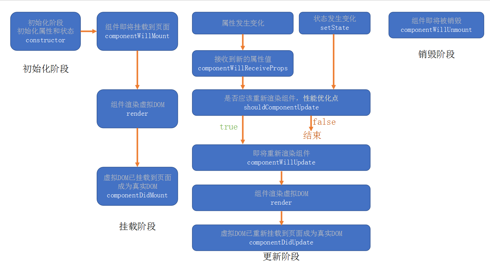
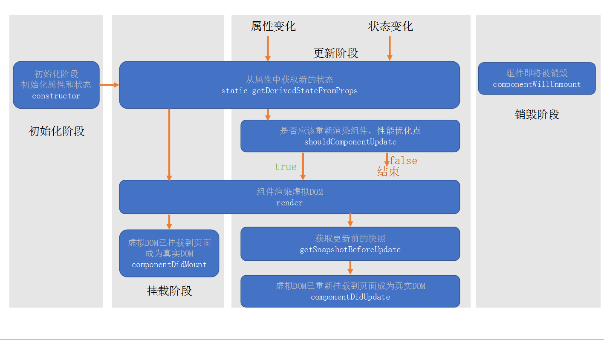

# react
## react概述
+ React 是一个用于构建用户界面的javascript库，核心专注于视图，目的是实现组件化开发
    ```
    组件的特性：
    1.可组合：一个组件可以和其他组件一起使用，或者可以直接嵌套在其他组建的内部
    2.可复用：每个组件都具有独立的功能，它可以被使用在多个场景中
    3.可维护：每个组件仅仅包含自身的逻辑，更容易被理解和维护
    ```
+ 开发环境
    ```
    cnpm i create-react-app -g
    create-react-app react2019
    cd react2019
    yarn start
    ```
+ react.js 是 React 的核心库
+ react-dom.js 是提供与DOM相关的功能,内部比较重要的方法是render,它用来向浏览器里插入DOM元素
## JSX
### 什么是JSX
+ jsx是一种将js和html混合的语法，将组件的结构、数据甚至样式都聚合在一起定义组件
+ jsx其实只是一种语法糖，最终会通过babel转成createElement语法
+ jsx表达式有且仅有一个根节点 React.Fragment
### React元素
+ 元素是构成React应用的最小单位
+ 元素用来描述屏幕上的内容
+ React当中的元素本质上是普通的js对象，ReactDom来确保浏览器中的DOM数据和React元素保持一致
```js
    //jsx表达式
    <h1 className="title" style={{color:'red'}}>hello</h1>
    //React写法
    React.createElement("h1", {
    className: "title",
    style: {
        color: 'red'
    }
    }, "hello");
    //最终返回结果
    {
    type:'h1',
    props:{
        className: "title",
        style: {
        color: 'red'
        }
    },
    children:"hello"
    }
```
### jsx使用
+ 可以任意的在jsx中使用javascript表达式，jsx中的表达式要包含在大括号里
+ jsx并不是html，在jsx中属性不能包含关键字，像class这种需要写成className，属性名需要使用驼峰命名法
+ jsx对象在if中使用
```js
import React from 'react';
import ReactDOM from 'react-dom';
function greeting(name) {
    if (name) {
      return <h1>Hello, {name}!</h1>;
    }
    return <h1>Hello, Stranger.</h1>;
  }
  let name = 'zhufeng';
  const element = greeting(name);

  ReactDOM.render(
    element,
    document.getElementById('root')
  );
```
+ jsx在for中使用
```js
    import React from 'react';
    import ReactDOM from 'react-dom';
    let names = ['张三','李四','王五'];
    let elements = [];
    for(let i=0;i<names.length;i++){
    elements.push(<li>{names[i]}</li>);
    }
    ReactDOM.render(
    <ul>
        {elements}
    </ul>,
    document.getElementById('root')
    );
```
+ null、undefined、false不会显示在表达式中
## 元素的更新与渲染
+ React元素都是不可变的，当元素被创建后是无法改变内容和属性的，一个元素就好像动画里的一帧，它代表应用界面在某一时间点的样子
+ 更新界面的唯一办法是创建一个新元素，然后将它传入ReactDom的render方法中
+ ReactDOM首先会比较元素先后的不同，在渲染过程中只会更新改变了的部分
+ 即便我们每秒都创建了一个描述整个UI树的新元素，React DOM 也只会更新渲染文本节点中发生变化的内容
## 组件
+ 函数组件返回一个React元素
+ 类组件必须继承React.Component,必须提供render函数，用于组件渲染
+ 组件名称的首字母必须大写
## 组件属性
+ 对于函数组件，属性会作为一个对象的属性，传递给函数的参数
+ 对于类组件，属性会作为一个对象的属性，传递给构造函数的参数
+ 组件的属性应该使用小驼峰命名法
+ React中的数据是自上而下流动，数据属于谁谁才有权利改动
+ React元素本身就是一个组件（内置组件）
## 组件的状态
+ 组将的状态仅在类组件中生效
+ 组件可以通过状态（state）维护数据
+ 组建中不能直接该状态，必须是用setState方法来更改状态，一旦调用setState方法，就会导致当前组件重新渲染
+ 出于性能考虑，React 可能会把多个 setState() 调用合并成一个调用
+ 因为 this.props 和 this.state 可能会异步更新，所以你不要依赖他们的值来更新下一个状态
+ 可以让 setState() 接收一个函数而不是一个对象。这个函数用上一个 state 作为第一个参数
+ props：该数据是由组件的使用者传递的数据，所有权不属于组件自身，因此组件无法改变该数组
+ state：该数组是由组件自身创建的，所有权属于组件自身，因此组件有权改变该数据
## setState
+ setState中状态的改变可能是异步的
  + 如果改变状态的代码处于某个html元素的事件中，则是异步的，否则是同步的
+ setState第二个参数接收一个函数，在状态改变后（render执行后）可获取改变后的sate
+ setState第一个参数可接受一个函数（解决多次改变状态的情况）
```js
state = {
    n:0
}
this.setState({
    n:this.state.n +1
})
this.setState({
    n:this.state.n +1
})
this.setState({
    n:this.state.n +1
})
//此时n的值仍为1
//因为setState是异步执行的 当执行时候n的初始值始终为0
this.setState((state)=>{n:state.n +1});
this.setState((state)=>{n:state.n +1});
this.setState((state)=>{n:state.n +1});
//此时n的值为3
//因为(state)=>{n:state.n +1} 中的state是被改变之后的，且该函数也是异步直至执行的
```
+ react会队setState进行优化，将多个setState进行合并，将多次状态改变完成过后，再统一对state进行改变，出发render函数。所以上述情况状态改了三次，render只触发一次
## react生命周期（旧版）React < 16.0.0
 
1. constructor
   1. 同一个组件只会创建一次
   2. 不能在第一次挂载到页面之前调用setState，为了避免问题，构造函数中严禁使用setState
2. componentWillMount
   1. 正常情况下，和构造函数一样，它只会运行一次
   2. 可以使用setState，但是为了避免bug，不允许使用，因为在某些特殊情况下，该函数可能被调用多次。
3. **render**
   1. 返回一个虚拟dom，最终渲染到页面的真实dom中
   2. render可能不只运行一次，只要冲洗渲染就会重新执行
   3. 严禁使用setState，因为可能会导致无线递归渲染
4. **componentDidMount**
   1.只会执行一次
   2.可以使用setState
   3.通常情况下，会将网络请求、启动计时器、等一开始需要的操作，写在该函数中
5. 组件进入活跃状态
6. componentWillReceiveProps
   1. 即将接收新的属性值
   2. 参数为新的属性值
   3. 该函数可能会导致一些bug
7. **shouldComponentUpdate**
   1. 指示react是否需要重新渲染该组件，通过返回true和false来指定
   2. 默认情况下，会直接返回true
8. componentWillUpdate
   1. 组件即将被重新渲染
9. componemtDidUpdate
   1. 往往在该函数中进行dom操作，改变元素
10. **componentWillUnmount**
   1.通常在函数中销毁一些组件依赖的资源，比如计时器
## react生命周期（新版） >= 16.0.0
 
+ React官方认为某个数据的来源必须是单一的
1. getDerivedStateFromProps
  1. 通过参数可以获取新的属性和状态
  2. 该函数是静态的
  3. 该函数的返回值会覆盖掉组件状态
  4. 该函数几乎是没有什么用
2. getSnapshotBeforeUpdate
  1. 真实的DOM构建完成，但还未实际渲染到页面中。
  2. 在该函数中，通常用于实现一些附加的dom操作
  3. 该函数的返回值，会作为componentDidUpdate的第三个参数
## 高阶组件（HOC）
+ HOF：Higher-Order Function, 高阶函数，以函数作为参数，并返回一个函数
+ HOC: Higher-Order Component, 高阶组件，以组件作为参数，并返回一个组件

>举例：20个组件，每个组件在创建组件和销毁组件时，需要作日志记录
```js
/**
 * 高阶组件
 * @param {*} comp 组件
 */
export default function withLog(Comp,str){
    return class LogWrapper extends React.Component{
       componentDidMount() {
            console.log(`日志：组件${Comp.name}被创建了！${Date.now()}`);
        }
        componentWillUnmount() {
            console.log(`日志：组件${Comp.name}被销毁了！${Date.now()}`);
        }
      render(){
        return(
          <>
           <h1>{str}</h1>
           <Comp {...this.props}>
          </>
        )
      }
    }
}
//使用高阶组件
class A extends React.Component{
    //不再关注跟该组件不相关的事情
    render(){
        return <h1>A:{this.props.a}</h1>
    }
}

let AComp = withLog(A,"aadsa");
<div>
<AComp/>
</div>
```
## ref
+ refs提供了一种方式，允许我们访问DOM节点或者在render方法中创建的React元素
+ ref的三种创建方式
  >1.String类型绑定。类似于vue中的ref绑定方式，可以通过this.refs[绑定的ref的名字]来获取dom，但这种方式不是最新版本react推荐的使用
  ```js
   import React, { Component } from 'react'
   export default class index extends Component {
        constructor(props){
            super(props) 
        }
        componentDidMount(){
            console.log(this.refs.aa)
        }
        render() {
            return (
                <div ref ="aa">
                    ref
                </div>
            )
        }
    }
  ```
  >2.react.CreateRef()。通过在class中使用React.createRef()方法创建一些变量，可以将这些变量绑定到标签的ref中
那么该变量的current则指向绑定的标签dom
  ```js
    import React, { Component } from 'react'
   export default class index extends Component {
      aa = React.createRef()
      constructor(props) {
          super(props)
      }
      componentDidMount() {
          console.log(this.aa.current)
      }
      render() {
          return (
              <div ref={this.aa}>
                  ref
              </div>
          )
      }
  ```
  >3.函数方式。在class中声明函数，在函数中绑定ref
使用这种方法可以将子组件暴露给父组件以使得父组件能够调用子组件的方法
  ```js
    import React, { Component } from 'react'
    export default class index extends Component {
          constructor(props){
              super(props) 
          }
          refFn = el => this.aa = el;
          componentDidMount(){
              console.log(this.aa)
          }
          render() {
              return (
                  <div ref ={this.refFn}>
                      ref
                  </div>
              )
          }
      }
  ```
+ ref转发
  - Ref 转发是一项将 ref 自动地通过组件传递到其一子组件的技巧。函数组件本身没有ref属性，但想要获取它内部的dom元素可以使用React.forwardRef
  ```js
   import React, { Component } from 'react'
   export default class index extends Component {
        ref = React.createRef();
        componentDidMount() {
            console.log(this.ref.current)
        }
        render() {
            let FancyButton = React.forwardRef((props, ref) => (
                <button ref={ref} className="FancyButton">
                    {props.children}
                </button>
            ));
            return (
                <div>
                    <FancyButton ref={this.ref}>Click me!</FancyButton>;
                </div>
            )
        }
    }
  ```
## hook
### state hook
State hook 是一个在函数组件中使用的函数（useState）,用于在函数组件中使用状态

useState

- 函数有一个参数，这个参数的值表示状态的默认值
- 函数的返回值是一个数组，该数组一定包含两项
  - 第一项：当前状态的值
  - 第二项：改变状态的函数
一个函数组件中可以有多个状态，这种做法非常有利于横向切分关注点

**注意的细节**

1. useState最好写在函数的起始位置，便于阅读
2. useState严禁出现在代码块中
3. useState返回的函数（数组的第二项），引用不变（节约内存空间）
4. 使用函数改变数据，若数据和之前的数据完全相等（使用object.is）比较，不会导致重新渲染，以达到优化效率的目的
5. 使用函数改变数据，传入的值不会和原来的数据进行合并，而是直接替换
6. 如果要实现强制刷新组件
    1. 类组件，使用forceUpdate函数
    2. 函数组件，使用一个空对象的useState：const [, forceUpdate] = useState({}); forceUpdate({}); 
7. **如果某些状态之间没有必然的联系，应该分化为不同的状态，而不要合并成一个对象**
8. 和类组件的状态一样，函数组件中改变状态可能是异步的（在dom事件中），多个状态变化会合并以提高效率，此时，不能信任之前的状态，而应该使用回调函数的方式改变状态。如果状态变化要使用之前的状态，尽量传递函数。
### effect hook
Effect Hook：用户函数组将中处理副作用

1. ajax
2. 计时器
3. 其他异步操作
4. 更改真实dom对象
5. 本地存储
6. 其他会对外部产生影响的操作

函数：useEffect,该函数接收一个函数作为参数，接收的函数就是需要进行副作用操作的函数

**细节**
1. 副作用函数的运行时间点，是在页面完成真实的UI渲染之后。因此它的执行是异步的，并不会阻塞浏览器
   1. 与类组件中componentDidMount和componentDidUpdate的区别
   2. componentDidMount和componentDidUpdate，更改了真实DOM，但是用户还没有看到UI更新，同步的。
   3. useEffect中的副作用函数，更改了真实DOM，并且用户已经看到了UI更新，异步的。
2. 每个函数组件中，可以多次使用useEffect，但不要放入判断或者循环等代码块中
3. useEffect中的副作用函数，可以有返回值，返回值必须是一个函数，该函数叫做清理函数
   1. 该函数运行时间点在每次运行副作用函数之前
   2. 首次渲染组件不会运行
   3. 组件销毁时一定会运行
4. useEffect函数可以传递第二个参数
   1. 第二个参数是一个数组
   2. 数组中记录着该副作用依赖的数据
   3. 当组件重新渲染后，只有依赖数据与上次不一样时，才会执行副作用
   4. 所以，当传递了依赖数据之后，如果数据没有发生变化
      1. 副作用仅在第一次渲染后执行
      2. 清理函数仅在卸载组件后运行
5. 副作用函数中，如果使用了函数上下文中的变量，则由于闭包的影响，会导致副作用函数中变量不会实时变化
6. 副作用函数在每次注册时，会覆盖掉之前的副作用函数，因此，尽量保持副作用函数的稳定，否则控制起来会比较复杂

