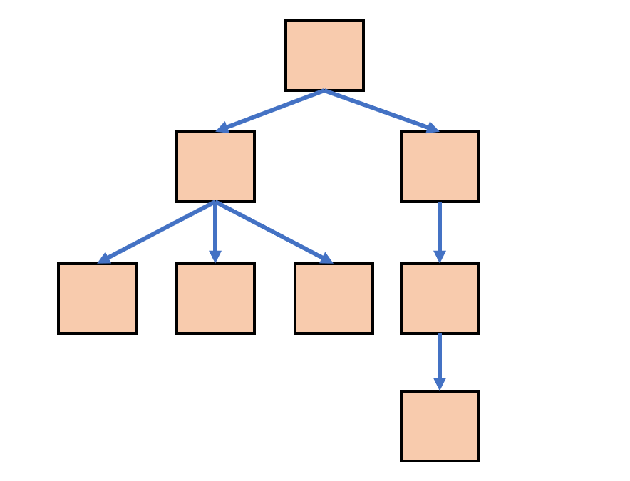

# 树形解构
## 树
树是一个类似于链表的二维结构，每个节点可以指向0个或者多个其他节点


树具有以下特点：

1. 单根：如果一个节点A指向了另一个节点B，仅能通过A直接找到B节点，不可能通过其他节点直接找到B节点
2. 无环：节点的指向不能形成环

树的术语

1. 节点的度：某个节点的度 == 该节点子节点的数量
2. 树的度：一棵树中，最大的子节点的度为该树的度
3. 节点的层，从跟开始定义起，跟为第1层，跟的子节点为第2层，以此类推
4. 树的高度或深度：树种节点的最大层次
5. 叶子节点：度为0的节点称为叶子节点
6. 分支节点：非叶子节点
7. 子节点、父节点：相对概念：如果A节点有一个子节点B，则A是B的父节点，B是A的子节点
8. 兄弟节点：如果两个节点有同一个父节点，则它们互为兄弟节点
9. 祖先节点：某个节点的祖先节点，是从树的根到改节点本身经过的所有节点
10. 后代节点：如果A是B的祖先节点，则B是A的后代节点

树的代码标识法
```js
function Node(value){
    this.value = value;
    this.children = [];
}
```
## 二叉树
如果一棵树的度为2，则该树是二叉树

二叉树可以用下面的代码表示
```js
function Node(value){
    this.value = value;
    this.left = null;
    this.right = null;
}
```
### 二叉树相关算法
1. 对二叉树遍历打印
   1. 前序遍历DLR
   ```js
   function DLR(root) {
        if (!root) return;// 没有节点
        console.log(root.value);
        DLR(root.left);
        DLR(root.right);
    }
   ```
   2. 中序遍历LDR
   ```js
   function LDR(root) {
        if (!root) return;// 没有节点
        LDR(root.left);
        console.log(root.value);
        LDR(root.right);
    }
   ```
   3. 后序遍历LRD
   ```js
   function LRD(root) {
        if (!root) return;// 没有节点
        LRD(root.left);
        LRD(root.right);
        console.log(root.value);
    }
   ```
2. 根据前序遍历和中序遍历的到一颗二叉树
```js
function getTree(dlr, ldr) {
    dlr = dlr.split("");
    ldr = ldr.split("");
    if (dlr.length !== ldr.length) throw new Error("无效的遍历值");
    if (dlr.length === 0) return null;

    var rootValue = dlr[0]; //取出根节点的值 
    var root = new Node(rootValue);

    var index = ldr.indexOf(rootValue); //找到根节点的值在中序遍历中的位置
    var leftLDR = ldr.slice(0, index).join(""); //左边的中序遍历结果
    var leftDLR = dlr.slice(1, leftLDR.length + 1).join(""); //左边的前序遍历结果
    root.left = getTree(leftDLR, leftLDR);

    var rightLDR = ldr.slice(index + 1).join(""); //右边的中序遍历结果
    var rightDLR = dlr.slice(leftLDR.length + 1).join(""); //右边的前序遍历结果
    root.right = getTree(rightDLR, rightLDR);

    return root;
}
```
3. 计算树的深度
```js
function getDeep(root) {
    if (!root) return 0;
    var left = getDeep(root.left);
    var right = getDeep(root.right);
    return Math.max(left, right) + 1;
}
```
4. 查询二叉树
   1. 深度优先 Depth First Search
   ```js
   function deepFirstSearch(root, targetValue) {
        if (!root) return false;
        console.log(root.value);
        if (root.value === targetValue) return true;
        //自己是一个节点，但是节点的值不是要找的值
        var resultLeft = deepFirstSearch(root.left, targetValue);
        var resultRight = deepFirstSearch(root.right, targetValue);
        return resultLeft || resultRight;
    }
   ```
   2. 广度优先 Breadth First Search
   ```js
   function breadthFirstSearch(nodes, targetValue) {
        if (nodes.length === 0) return false;//搜不到
        var nexts = []; //下一层的结点
        for (var i = 0; i < nodes.length; i++) {
            if (nodes[i].value === targetValue) {
                return true;
            }
            else {
                if (nodes[i].left) {
                    nexts.push(nodes[i].left)
                }
                if (nodes[i].right) {
                    nexts.push(nodes[i].right)
                }
            }
        }
        console.log(nexts)
        //这一层找不到了，找下一层
        return breadthFirstSearch(nexts, targetValue);
    }
   ```
5. 比较两颗二叉树，得到对比结果
```js
function diff(originRoot, newRoot) {
    var results = []; //记录所有的差异

    if (!originRoot && !newRoot) {
        return [];//两个结点没东西，无差异
    }
    else if (!originRoot && newRoot) {
        //属于新增
        results.push({
            type: "新增",
            originNode: originRoot,
            newNode: newRoot
        })
    }
    else if (originRoot && !newRoot) {
        //属于删除
        results.push({
            type: "删除",
            originNode: originRoot,
            newNode: newRoot
        })
    }
    else if (originRoot.value !== newRoot.value) {
        //属于修改
        results.push({
            type: "修改",
            originNode: originRoot,
            newNode: newRoot
        })

        var results1 = diff(originRoot.left, newRoot.left)
        var results2 = diff(originRoot.right, newRoot.right);
        //将后续的差异汇总到当前的差异数组中
        results = results.concat(results1).concat(results2)
    }
    else {
        //两个结点一样，继续向后比较
        var results1 = diff(originRoot.left, newRoot.left)
        var results2 = diff(originRoot.right, newRoot.right);
        //将后续的差异汇总到当前的差异数组中
        results = results.concat(results1).concat(results2)
    }

    return results;
}
```