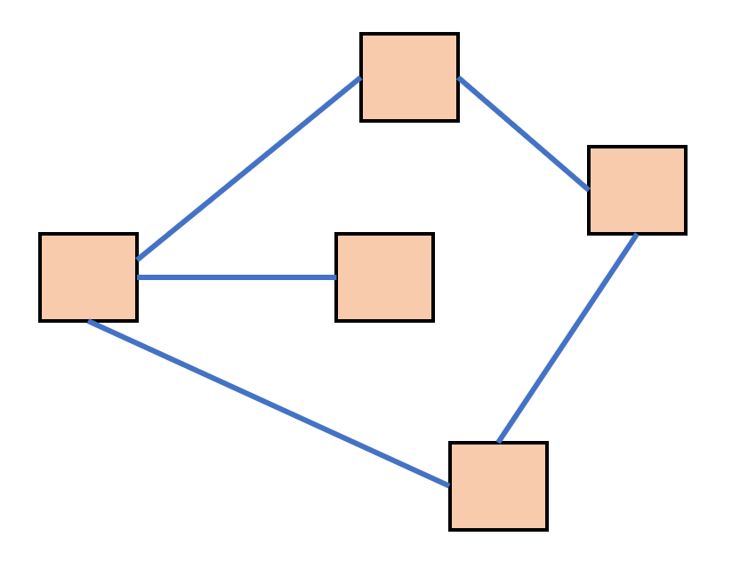

# 图形结构
## 图的基本概念

图结构中，一个结点可以链接到任意结点，所有结点链接而成的结构，即为图结构

图结构中的链接可以是有向的，也可以是无向的（双向链接），本文仅讨论双向链接

树结构是一种特殊的图结构

图结构没有根，可以有环，但是在一个图结构中，不能存在两个或以上的孤立结点

可以使用图中任何一个结点表示整个图结构

图结构是一种常见的数据结构，例如网络爬虫抓取的网页就是一种典型的图结构

图结构的代码可表示为：

```js
function Node(value){
    this.value = value;
    this.neighbors = [];
}
```
## 深度优先查询
```js
/**
 * 深度优先遍历
 * @param {*} node 
 * @param {*} targetValue 
 * @param finded 已经找过的结点
 */
function deepFirstSearch(node, targetValue, finded) {
    //如果finded数组中包含了node，说明，当前结点已经被看过了，直接返回
    if (finded.includes(node)) return false;
    if (node.value === targetValue) return true;
    finded.push(node); //将当前结点加入到已找过的结点
    //自己不是要找到，看相邻结点
    for (var i = 0; i < node.neighbors.length; i++) {
        if (deepFirstSearch(node.neighbors[i], targetValue, finded)) {
            //在其中一个相邻结点的深搜过程中找到了
            return true;
        }
    }
    return false; //所有相邻的结点的深搜过程中都找不到
}
```
## 广度优先查询
```js
/**
 * 图的广搜
 * @param {*} nodes 要找的某一群结点，该数组中的结点都是没有找过的
 * @param {*} targetValue 
 * @param finded 已经找过的结点
 */
function breadthFirstSearch(nodes, targetValue, finded) {
    if (nodes.length === 0) return false;
    var nexts = [];
    for (var i = 0; i < nodes.length; i++) {
        if (nodes[i].value === targetValue) {
            return true;
        }
        //说明该结点已找过
        finded.push(nodes[i]);
        //直接将该结点的相邻结点加入到数组nexts
        for (var j = 0; j < nodes[i].neighbors.length; j++) {
            var n = nodes[i].neighbors[j]; //第j个邻居
            if (!nexts.includes(n)) {
                nexts.push(n);
            }
        }
    }
    //重新对nexts进行处理
    for (var i = 0; i < nexts.length; i++) {
        if (finded.includes(nexts[i])) {
            nexts.splice(i, 1);
            i--;
        }
    }
   
    console.log(nexts);
    return breadthFirstSearch(nexts, targetValue, finded);
}
```
