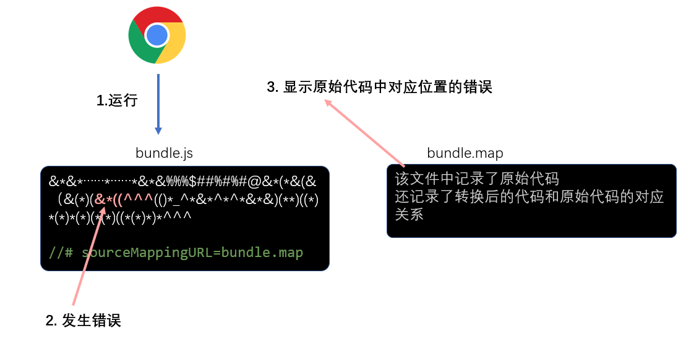
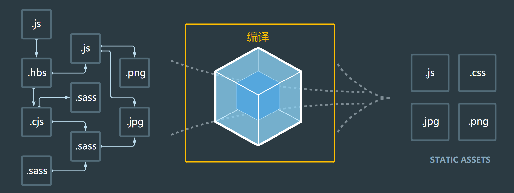
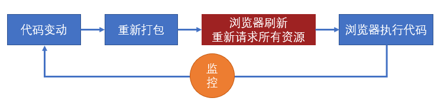

# webpack 基础
## 基本概念
### webapck简介
webpack是基于模块化的打包（构建）工具，它把一切视为模块

它通过一个开发时态的入口模块为起点，分析出所有的依赖关系，然后经过一系列的过程（压缩、合并），最终生成运行时态的文件。
### webpack特点
+ **为前端工程化而生：** webpack致力于解决前端工程化，特别是浏览器端工程化中遇到的问题，让开发者集中注意力编写业务代码，而把工程化过程中的问题全部交给webpack来处理

+ **简单易用：** 支持零配置，可以不用写任何一行额外的代码就使用webpack

+ **强大的生态：** webpack是非常灵活、可以扩展的，webpack本身的功能并不多，但它提供了一些可以扩展其功能的机制，使得一些第三方库可以融于到webpack中

+ **基于nodejs：** 由于webpack在构建的过程中需要读取文件，因此它是运行在node环境中的

+ **基于模块化：** webpack在构建过程中要分析依赖关系，方式是通过模块化导入语句进行分析的，它支持各种模块化标准，包括但不限于CommonJS、ES6 Module

### 注意事项
+ 默认情况下，webpack会以./src/index.js作为入口文件分析依赖关系，打包到./dist/main.js文件中

+ 通过--mode选项可以控制webpack的打包结果的运行环境
## 安装
### webpack通过npm安装，它提供了两个包：
+ **webpack：** 核心包，包含了webpack构建过程中要用到的所有api

+ **webpack-cli：** 提供一个简单的cli命令，它调用了webpack核心包的api，来完成构建过程
### 安装方式：
+ **全局安装：** 可以全局使用webpack命令，但是无法为不同项目对应不同的webpack版本，不推荐使用

+ **本地安装：** 推荐，每个项目都使用自己的webpack版本进行构建
```bash
npm install webpack webpack-cli -D
```
## 模块化的兼容性
### 同模块化标准 

如果导出和导入使用的是同一种模块化标准，打包后的效果和之前学习的模块化没有任何差异


### 不同模块化标准

不同的模块化标准，webpack按照如下的方式处理


## 配置文件
webpack提供的cli支持很多的参数，例如```--mode```，但更多的时候，我们会使用更加灵活的配置文件来控制webpack的行为

默认情况下，webpack会读取```webpack.config.js```文件作为配置文件，但也可以通过CLI参数```--config```来指定某个配置文件

配置文件中通过CommonJS模块导出一个对象，对象中的各种属性对应不同的webpack配置

**注意：配置文件中的代码，必须是有效的node代码**

### 基本配置

1. mode：编译模式，字符串，取值为development或production，指定编译结果代码运行的环境，会影响webpack对编译结果代码格式的处理

2. entry：入口，字符串（后续会详细讲解），指定入口文件

3. output：出口，对象（后续会详细讲解），指定编译结果文件

## devtool配置
### source map 源码地图
前端发展到现阶段，很多时候都不会直接运行源代码，可能需要对源代码进行合并、压缩、转换等操作，真正运行的是转换后的代码


这就给调试带来了困难，因为当运行发生错误的时候，我们更加希望能看到源代码中的错误，而不是转换后代码的错误


为了解决这一问题，chrome浏览器率先支持了source map，其他浏览器纷纷效仿，目前，几乎所有新版浏览器都支持了source map

source map实际上是一个配置，配置中不仅记录了所有源码内容，还记录了和转换后的代码的对应关系

下面是浏览器处理source map的原理




### 实际应用
1. source map 应在开发环境中使用，作为一种调试手段
2. source map 不应该在生产环境中使用，source map的文件一般较大，不仅会导致额外的网络传输，还容易暴露原始代码。即便要在生产环境中使用source map，用于调试真实的代码运行问题，也要做出一些处理规避网络传输和代码暴露的问题。
### webpack中的source map
使用 webpack 编译后的代码难以调试，可以通过 devtool 配置来**优化调试体验**

具体的配置见文档：https://www.webpackjs.com/configuration/devtool/
## 编译过程

webpack 的作用是将源代码编译（构建、打包）成最终代码



**整个过程大致分为三个步骤**

1. 初始化
2. 编译
3. 输出


### 初始化
此阶段，webpack会将**CLI参数**、**配置文件**、**默认配置**进行融合，形成一个最终的配置对象。

对配置的处理过程是依托一个第三方库```yargs```完成的

此阶段相对比较简单，主要是为接下来的编译阶段做必要的准备

目前，可以简单的理解为，初始化阶段主要用于产生一个最终的配置
### 编译
1. **创建chunk**

chunk是webpack在内部构建过程中的一个概念，译为```块```，它表示通过某个入口找到的所有依赖的统称。

根据入口模块（默认为```./src/index.js```）创建一个chunk


每个chunk都有至少两个属性：

- name：默认为main
- id：唯一编号，开发环境和name相同，生产环境是一个数字，从0开始

2. **构建所有依赖模块**


> AST在线测试工具：https://astexplorer.net/

简图


3. **产生chunk assets**

在第二步完成后，chunk中会产生一个模块列表，列表中包含了**模块id**和**模块转换后的代码**

接下来，webpack会根据配置为chunk生成一个资源列表，即```chunk assets```，资源列表可以理解为是生成到最终文件的文件名和文件内容


> chunk hash是根据所有chunk assets的内容生成的一个hash字符串
> hash：一种算法，具体有很多分类，特点是将一个任意长度的字符串转换为一个固定长度的字符串，而且可以保证原始内容不变，产生的hash字符串就不变

简图


4. **合并chunk assets**

将多个chunk的assets合并到一起，并产生一个总的hash


### 输出
此步骤非常简单，webpack将利用node中的fs模块（文件处理模块），根据编译产生的总的assets，生成相应的文件。


### 总过程


### 涉及术语
1. module：模块，分割的代码单元，webpack中的模块可以是任何内容的文件，不仅限于JS
2. chunk：webpack内部构建模块的块，一个chunk中包含多个模块，这些模块是从入口模块通过依赖分析得来的
3. bundle：chunk构建好模块后会生成chunk的资源清单，清单中的每一项就是一个bundle，可以认为bundle就是最终生成的文件
4. hash：最终的资源清单所有内容联合生成的hash值
5. chunkhash：chunk生成的资源清单内容联合生成的hash值
6. chunkname：chunk的名称，如果没有配置则使用main
7. id：通常指chunk的唯一编号，如果在开发环境下构建，和chunkname相同；如果是生产环境下构建，则使用一个从0开始的数字进行编号
## 出口与入口
### 一个页面一个js


源码结构

```
|—— src
    |—— pageA   页面A的代码目录
        |—— index.js 页面A的启动模块
        |—— ...
    |—— pageB   页面B的代码目录
        |—— index.js 页面B的启动模块
        |—— ...
    |—— pageC   页面C的代码目录
        |—— main1.js 页面C的启动模块1 例如：主功能
        |—— main2.js 页面C的启动模块2 例如：实现访问统计的额外功能
        |—— ...
    |—— common  公共代码目录
        |—— ...
```
**webpack配置**
```js
module.exports = {
    entry:{
        pageA: "./src/pageA/index.js",
        pageB: "./src/pageB/index.js",
        pageC: ["./src/pageC/main1.js", "./src/pageC/main2.js"]
    },
    output:{
        filename:"[name].[chunkhash:5].js"
    }
}
```
这种方式适用于页面之间的功能差异巨大、公共代码较少的情况，这种情况下打包出来的最终代码不会有太多重复
### 一个页面多个JS


源码结构

```
|—— src
    |—— pageA   页面A的代码目录
        |—— index.js 页面A的启动模块
        |—— ...
    |—— pageB   页面B的代码目录
        |—— index.js 页面B的启动模块
        |—— ...
    |—— statistics   用于统计访问人数功能目录
        |—— index.js 启动模块
        |—— ...
    |—— common  公共代码目录
        |—— ...
```
**webpack配置**

```js
module.exports = {
    entry:{
        pageA: "./src/pageA/index.js",
        pageB: "./src/pageB/index.js",
        statistics: "./src/statistics/index.js"
    },
    output:{
        filename:"[name].[chunkhash:5].js"
    }
}
```
这种方式适用于页面之间有一些**独立**、相同的功能，专门使用一个chunk抽离这部分JS有利于浏览器更好的缓存这部分内容。

### 单页应用

所谓单页应用，是指整个网站（或网站的某一个功能块）只有一个页面，页面中的内容全部靠JS创建和控制。 vue和react都是实现单页应用的利器。


源码结构

```
|—— src
    |—— subFunc   子功能目录
        |—— ...
    |—— subFunc   子功能目录
        |—— ...
    |—— common  公共代码目录
        |—— ...
    |—— index.js
```
webpack配置

```js
module.exports = {
    entry: "./src/index.js",
    output:{
        filename:"index.[hash:5].js"
    }
}
```
## loader
> webpack做的事情，仅仅是分析出各种模块的依赖关系，然后形成资源列表，最终打包生成到指定的文件中。
> 更多的功能需要借助webpack loaders和webpack plugins完成。

webpack loader： loader本质上是一个函数，它的作用是将某个源码字符串转换成另一个源码字符串返回。


loader函数的将在模块解析的过程中被调用，以得到最终的源码。

**全流程：**


**chunk中解析模块的流程：**


**chunk中解析模块的更详细流程：**


**处理loaders流程：**


### loader配置

**完整配置**

```js
module.exports = {
    module: { //针对模块的配置，目前版本只有两个配置，rules、noParse
        rules: [ //模块匹配规则，可以存在多个规则
            { //每个规则是一个对象
                test: /\.js$/, //匹配的模块正则
                use: [ //匹配到后应用的规则模块
                    {  //其中一个规则
                        loader: "模块路径", //loader模块的路径，该字符串会被放置到require中
                        options: { //向对应loader传递的额外参数

                        }
                    }
                ]
            }
        ]
    }
}
```
**简化配置**

```js
module.exports = {
    module: { //针对模块的配置，目前版本只有两个配置，rules、noParse
        rules: [ //模块匹配规则，可以存在多个规则
            { //每个规则是一个对象
                test: /\.js$/, //匹配的模块正则
                use: ["模块路径1", "模块路径2"]//loader模块的路径，该字符串会被放置到require中
            }
        ]
    }
}
```
## plugin 
loader的功能定位是转换代码，而一些其他的操作难以使用loader完成，比如：
+ 当webpack生成文件时，顺便多生成一个说明描述文件
+ 当webpack编译启动时，控制台输出一句话标识webpack启动了
+ 当xxx时，xxxx
这种类似的功能需要把功能嵌入到webpack的编译流程中，而这种事情的实现是依托于plugin的


plugin的**本质**是一个带有apply方法的对象

```js
var plugin = {
    apply:function(){

    }
}
```

通常，习惯上，我们会将该对象写成构造函数的模式
```js
class myPlugin{
    apply(compiler){
      
    }
}
var plugin = new myPlugin()
```

要将插件应用到webpack中，需要把插件对象配置到webpack的plugins数组中，如下：
```js
module.exports = {
    plugins:[
        new myPlugin()
    ]
}
```
apply函数会在初始化阶段，创建好Compiler对象后运行

compiler对象是在初始化阶段构建的，整个webpack打包期间只有一个compiler对象，后续完成打包工作是complier对象内部创建的compilation

apply会在**创建好compiler对象后调用**，并向方法传入一个complier对象。


complier对象提供了大量的钩子函数（hooks，可以理解为事件），plugin开发者可以注册这些钩子函数，参与webpack编译和生成

你可以在apply方法中使用下面的代码注册钩子函数

```js
class MyPlugin{
    apply(compiler){
        compiler.hooks.事件名称.事件类型(name, function(compilation){
            //事件处理函数
        })
    }
}
```
**事件名称**
即要监听的事件名，即钩子名，所有的钩子：https://www.webpackjs.com/api/compiler-hooks
**事件类型**

这一部分使用的是 Tapable API，这个小型的库是一个专门用于钩子函数监听的库。

它提供了一些事件类型：

- tap：注册一个同步的钩子函数，函数运行完毕则表示事件处理结束
- tapAsync：注册一个基于回调的异步的钩子函数，函数通过调用一个回调表示事件处理结束
- tapPromise：注册一个基于Promise的异步的钩子函数，函数通过返回的Promise进入已决状态表示事件处理结束

**处理函数**

处理函数有一个事件参数```compilation```
## 环境配置

有些时候，我们需要针对生产环境和开发环境分别书写webpack配置

为了更好的适应这种要求，webpack允许配置不仅可以是一个对象，还可以是一个**函数**

```js
module.exports = env => {
    return {
        //配置内容
    }
}
```

在开始构建时，webpack如果发现配置是一个函数，会调用该函数，将函数返回的对象作为配置内容，因此，开发者可以根据不同的环境返回不同的对象

在调用webpack函数时，webpack会向函数传入一个参数env，该参数的值来自于webpack命令中给env指定的值，例如

```shell
npx webpack --env abc # env: "abc"

npx webpack --env.abc # env: {abc:true}
npx webpack --env.abc=1  # env： {abc:1}
npx webpack --env.abc=1 --env.bcd=2 # env: {abc:1, bcd:2}
```

这样一来，我们就可以在命令中指定环境，在代码中进行判断，根据环境返回不同的配置结果。
## 其他配置
### context
```js
context:path.resolve(__dirname,"app")
```
该配置会影响入口和loaders的解析，入口和loaders的相对路径会以context的配置作为基准路径，这样，你的配置会独立于CWD（current working directory 当前执行路径）
### output
+ library
```js
library: "abc"
```
这样一来，打包后的结果中，会将自执行函数的结果暴露给abc
+ libraryTarget

```js
libraryTarget: "var"
```
该配置可以更加精细的控制如何暴露入口包的导出结果

其他可用的值有：
  - var：默认值，暴露给一个普通变量
  - window：暴露给window对象的一个属性
  - this：暴露给this的一个属性
  - global：暴露给global的一个属性
  - commonjs：暴露给exports的一个属性
  - 其他：https://www.webpackjs.com/configuration/output/#output-librarytarget 
### target

```js
target:"web" //默认值
```

设置打包结果最终要运行的环境，常用值有

- web: 打包后的代码运行在web环境中
- node：打包后的代码运行在node环境中
- 其他：https://www.webpackjs.com/configuration/target/

### module.noParse
```js
noParse: /jquery/
```
不解析正则表达式匹配的模块，通常用它来忽略那些大型的单模块库，以提高**构建性能**

### resolve
resolve的相关配置主要用于控制模块解析过程

+ modules
```js
modules: ["node_modules"]  //默认值
```

当解析模块时，如果遇到导入语句，```require("test")```，webpack会从下面的位置寻找依赖的模块

1. 当前目录下的```node_modules```目录
2. 上级目录下的```node_modules```目录
3. ...
+ extensions

```js
extensions: [".js", ".json"]  //默认值
```
当解析模块时，遇到无具体后缀的导入语句，例如```require("test")```，会依次测试它的后缀名

  1. test.js
  2. test.json

+ alias

```js
alias: {
  "@": path.resolve(__dirname, 'src'),
  "_": __dirname
}
```

有了alias（别名）后，导入语句中可以加入配置的键名，例如```require("@/abc.js")```，webpack会将其看作是```require(src的绝对路径+"/abc.js")```。

在大型系统中，源码结构往往比较深和复杂，别名配置可以让我们更加方便的导入依赖

+ externals

```js
externals: {
    jquery: "$",
    lodash: "_"
}
```

从最终的bundle中排除掉配置的配置的源码，例如，入口模块是

```js
//index.js
require("jquery")
require("lodash")
```

生成的bundle是：

```js
(function(){
    ...
})({
    "./src/index.js": function(module, exports, __webpack_require__){
        __webpack_require__("jquery")
        __webpack_require__("lodash")
    },
    "jquery": function(module, exports){
        //jquery的大量源码
    },
    "lodash": function(module, exports){
        //lodash的大量源码
    },
})
```

但有了上面的配置后，则变成了

```js
(function(){
    ...
})({
    "./src/index.js": function(module, exports, __webpack_require__){
        __webpack_require__("jquery")
        __webpack_require__("lodash")
    },
    "jquery": function(module, exports){
        module.exports = $;
    },
    "lodash": function(module, exports){
        module.exports = _;
    },
})
```
这比较适用于一些第三方库来自于外部CDN的情况，这样一来，即可以在页面中使用CDN，又让bundle的体积变得更小，还不影响源码的编写
### stats

stats控制的是构建过程中控制台的输出内容
## clean-webpack-plugin
当我们使用webpack打包时，如果打包多次，不去做特殊处理，打包生成的文件中就会包含上次打包遗留的内容，后来打出的包会有多余的内容使包变大，所以我们需要借助clean-webpack-plugin，使用这个插件，每次打包的时候，就会自动清除webpaco.config.js中output下的文件
```js
var { CleanWebpackPlugin } = require("clean-webpack-plugin")
module.exports = {
    mode: "development",
    devtool: "source-map",
    output: {
        filename: "[name].[chunkhash:5].js"
    },
    plugins: [
        new CleanWebpackPlugin()
    ]
}
```
## html-webpack-plugin
该插件将为你生成一个 HTML5 文件， 其中包括使用 script 标签的 body 中的所有 webpack 包。 只需添加插件到你的 webpack 配置如下：
```js
const { CleanWebpackPlugin } = require("clean-webpack-plugin")
const HtmlWebpackPlugin = require('html-webpack-plugin')
module.exports = {
    mode: "development",
    devtool: "source-map",
    entry: {
        home: "./src/index.js",
        a: "./src/a.js"
    },
    output: {
        filename: "scripts/[name].[chunkhash:5].js"
    },
    plugins: [
        new CleanWebpackPlugin(),
        new HtmlWebpackPlugin({
            template: "./public/index.html",
            filename: "home.html",
            chunks: ["home"]
        }),
        new HtmlWebpackPlugin({
            template: "./public/index.html",
            filename: "a.html",
            chunks: ["a"]
        })
    ]
}
```
## copy-webpack-plugin
在webpack中拷贝文件和文件夹
```js
let {CleanWebpackPlugin} = require('clean-webpack-plugin');
let HtmlWebpackPlugin = require('html-webpack-plugin');
let CopyWebpackPlugin = require("copy-webpack-plugin");
module.exports = {
    mode:"development",
    devtool:"source-map",
    entry:{
        main:"./src/index.js",
        a:"./src/a.js"
    },
    output:{
        filename:"[name].[chunkhash:5].js"
    },
    plugins:[
        new CleanWebpackPlugin(),
        new HtmlWebpackPlugin({
            template:"./public/main.html",
            filename:"main.html",
            chunks:["main"]
        }),
        new HtmlWebpackPlugin({
            template:"./public/a.html",
            filename:"a.html",
            chunks:["a"]
        }),
        new CopyWebpackPlugin({
            patterns:[
                { from: "./t", to: "./"}
            ]
        })

    ]
}
```
## webpack-dev-server
1. 安装
```bash
cnpm install webpack-dev-server
```
2. 执行```webpack-dev-server```
```webpack-dev-server```命令几乎支持所有的webpack命令，如```--config```、```-env```等等，你可以把它当作webpack命令使用，这个命令是专门为开发阶段服务的，真正部署的时候还是得使用webpack命令

当我们执行```webpack-dev-server```命令后，它做了以下操作：

1. 内部执行webpack命令，传递参数
2. 开启watch
3. 注册hooks：类似于plugin，webpack-dev-server会向webpack中注册一些钩子函数，主要功能如下：
   1. 将资源列表aseets保存起来
   2. 禁止webpack输出文件
4. 用express开启一个服务器，监听某个端口，当请求到达后，根据请求的路径，给与相应的资源内容

**配置**

针对webpack-dev-server的配置，参考：https://www.webpackjs.com/configuration/dev-server/

常见配置有：

- port：配置监听端口
- proxy：配置代理，常用于跨域访问
- stats：配置控制台输出内容
```js
  devServer: {
        port: 8000,
        open: true,
        proxy: { //代理规则
            "/api": {
                target: "http://open.duyiedu.com",
                changeOrigin: true //更改请求头中的host和origin
            }
        },
          stats: {
            modules: false,
            colors: true
        }
    },
  
```
## 普通文件处理
### file-loader
生成依赖文件到输出目录，然后将模块文件设置为：导出一个路径
```js
//file-loader
function loader(source){
	// source：文件内容（图片内容 buffer）
	// 1. 生成一个具有相同文件内容的文件到输出目录
	// 2. 返回一段代码   export default "文件名"
}
```
### url-loader
将依赖的文件转换为：导出一个base64格式的字符串
```js
//file-loader
function loader(source){
	// source：文件内容（图片内容 buffer）
	// 1. 根据buffer生成一个base64编码
	// 2. 返回一段代码   export default "base64编码"
}
```
## 解决路径问题

在使用file-loader或url-loader时，可能会遇到一个非常有趣的问题

比如，通过webpack打包的目录结构如下：

```yaml
dist
    |—— img
        |—— a.png  #file-loader生成的文件
    |—— scripts
        |—— main.js  #export default "img/a.png"
    |—— html
        |—— index.html #<script src="../scripts/main.js" ></script>
```

这种问题发生的根本原因：模块中的路径来自于某个loader或plugin，当产生路径时，loader或plugin只有相对于dist目录的路径，并不知道该路径将在哪个资源中使用，从而无法确定最终正确的路径

面对这种情况，需要依靠webpack的配置publicPath解决
## webpack内置插件 {ignore}

所有的webpack内置插件都作为webpack的静态属性存在的，使用下面的方式即可创建一个插件对象

```js
const webpack = require("webpack")

new webpack.插件名(options)
```

### DefinePlugin

全局常量定义插件，使用该插件通常定义一些常量值，例如：

```js
new webpack.DefinePlugin({
    PI: `Math.PI`, // PI = Math.PI
    VERSION: `"1.0.0"`, // VERSION = "1.0.0"
    DOMAIN: JSON.stringify("duyi.com")
})
```

这样一来，在源码中，我们可以直接使用插件中提供的常量，当webpack编译完成后，会自动替换为常量的值

### BannerPlugin

它可以为每个chunk生成的文件头部添加一行注释，一般用于添加作者、公司、版权等信息

```js
new webpack.BannerPlugin({
  banner: `
  hash:[hash]
  chunkhash:[chunkhash]
  name:[name]
  author:yuanjin
  corporation:duyi
  `
})
```

### ProvidePlugin

自动加载模块，而不必到处 import 或 require 

```js
new webpack.ProvidePlugin({
  $: 'jquery',
  _: 'lodash'
})
```

然后在我们任意源码中：

```js
$('#item'); // <= 起作用
_.drop([1, 2, 3], 2); // <= 起作用
```
## 利用webpack拆分css
要拆分css，就必须把css当成js那样的模块；要把css当成模块，就必须有一个构件工具（webpack），它具备合并代码的能力，而webpack本身只能读取css文件的内容，将其当做js代码进行分析，因此会导致错误

于是，就必须有一个loader，能将css代码转换为js代码
### css-loader
css-loader的作用，就是将css代码转换为js代码

它的处理原理极其简单：将css代码作为字符串导出

例如：
```css
.red{
    color:"#f40";
}
```
经过css-loader转换后变成js代码：
```js
module.exports = `.red{
    color:"#f40";
}`
```
> 上面的js代码是经过我简化后的，不代表真实的css-loader的转换后代码，css-loader转换后的代码会有些复杂，同时会导出更多的信息，但核心思想不变
再例如：
```css
.red{
    color:"#f40";
    background:url("./bg.png")
}
```
经过css-loader转换后变成js代码：
```js
var import1 = require("./bg.png");
module.exports = `.red{
    color:"#f40";
    background:url("${import1}")
}`;
```
这样一来，经过webpack的后续处理，会把依赖```./bg.png```添加到模块列表，然后再将代码转换为

```js
var import1 = __webpack_require__("./src/bg.png");
module.exports = `.red{
    color:"#f40";
    background:url("${import1}")
}`;
```
再例如：
```css
@import "./reset.css";
.red{
    color:"#f40";
    background:url("./bg.png")
}
```
会转换为：
```js
var import1 = require("./reset.css");
var import2 = require("./bg.png");
module.exports = `${import1}
.red{
    color:"#f40";
    background:url("${import2}")
}`;
```
**总结，css-loader干了什么：**

1. 将css文件的内容作为字符串导出
2. 将css中的其他依赖作为require导入，以便webpack分析依赖

### style-loader
由于css-loader仅提供了将css转换为字符串导出的能力，剩余的事情要交给其他loader或plugin来处理

style-loader可以将css-loader转换后的代码进一步处理，将css-loader导出的字符串加入到页面的style元素中

例如：

```css
.red{
    color:"#f40";
}
```
经过css-loader转换后变成js代码：
```js
module.exports = `.red{
    color:"#f40";
}`
```
经过style-loader转换后变成：
```js
module.exports = `.red{
    color:"#f40";
}`
var style = module.exports;
var styleElem = document.createElement("style");
styleElem.innerHTML = style;
document.head.appendChild(styleElem);
module.exports = {}
```
> 以上代码均为简化后的代码，并不代表真实的代码
> style-loader有能力避免同一个样式的重复导入

## css module {ignore}

> 通过命名规范来限制类名太过死板，而css in js虽然足够灵活，但是书写不便。
> css module 开辟一种全新的思路来解决类名冲突的问题

### 思路

css module 遵循以下思路解决类名冲突问题：

1. css的类名冲突往往发生在大型项目中
2. 大型项目往往会使用构建工具（webpack等）搭建工程
3. 构建工具允许将css样式切分为更加精细的模块
4. 同JS的变量一样，每个css模块文件中难以出现冲突的类名，冲突的类名往往发生在不同的css模块文件中
5. 只需要保证构建工具在合并样式代码后不会出现类名冲突即可


### 实现原理

在webpack中，作为处理css的css-loader，它实现了css module的思想，要启用css module，需要将css-loader的配置```modules```设置为```true```。

css-loader的实现方式如下：


原理极其简单，开启了css module后，css-loader会将样式中的类名进行转换，转换为一个唯一的hash值。

由于hash值是根据模块路径和类名生成的，因此，不同的css模块，哪怕具有相同的类名，转换后的hash值也不一样。


### 如何应用样式

css module带来了一个新的问题：源代码的类名和最终生成的类名是不一样的，而开发者只知道自己写的源代码中的类名，并不知道最终的类名是什么，那如何应用类名到元素上呢？

为了解决这个问题，css-loader会导出原类名和最终类名的对应关系，该关系是通过一个对象描述的


这样一来，我们就可以在js代码中获取到css模块导出的结果，从而应用类名了

style-loader为了我们更加方便的应用类名，会去除掉其他信息，仅暴露对应关系

### 其他操作

**全局类名** 

某些类名是全局的、静态的，不需要进行转换，仅需要在类名位置使用一个特殊的语法即可：

```css
:global(.main){
    ...
}
```

使用了global的类名不会进行转换，相反的，没有使用global的类名，表示默认使用了local

```css
:local(.main){
    ...
}
```

使用了local的类名表示局部类名，是可能会造成冲突的类名，会被css module进行转换

**如何控制最终的类名**

绝大部分情况下，我们都不需要控制最终的类名，因为控制它没有任何意义

如果一定要控制最终的类名，需要配置css-loader的```localIdentName```

### 其他注意事项

- css module往往配合构建工具使用
- css module仅处理顶级类名，尽量不要书写嵌套的类名，也没有这个必要
- css module仅处理类名，不处理其他选择器
- css module还会处理id选择器，不过任何时候都没有使用id选择器的理由
- 使用了css module后，只要能做到让类名望文知意即可，不需要遵守其他任何的命名规范
## babel的安装和使用
babel可以和构建工具联合使用，也可以独立使用

如果要独立使用babel，需要安装下面两个库
+ @babel/core：babel核心库，提供了编译所需要的的所有api
+ @babel/clli：提供一个命令行工具，调用核心库的api完成编译
```shell
npm install -D @babel/core @babel/cli
```
### babel的使用
@babel/cli的使用极其简单

它提供了一个命令`babel`
```shell
#按文件编译
babel 要编译的文件 -o 编译结果文件
#按目录编译
babel 要编译的整个目录 -d 编译结果放置的目录
```
### bable的配置
可以看到，babel本身没有做任何事情，真正的编译要依托于**babel插件**和**babel预设**来完成
>babel预设和postcss预设含义一样，是多个插件的集合体，用于解决一系列常见的兼容问题

需要通过一个配置文件`.babelrc`
```json
{
    "presets":[],
    "plugins":[]
}
```
## babel预设
babel有多种预设，最常见的是`@babel/preset-env`

`@babel/preset-env`可以让你使用最新的JS语法，而无需针对每种语法转换设置具体的插件

### 配置
```json
{
    "presets":[
        "@babel/preset-env"
    ]
}
```
### 兼容的浏览器
`@babel/preset-env`需要根据兼容的浏览器范围来确定如何编译，和postcss一样，可以使用文件`.browserslistrc`来描述浏览器的兼容范围
```
last 3 version
> 1%
not ie <= 8
```
### 预设的配置
```json
{
    "presets": [
        ["@babel/preset-env", {
            "配置项1": "配置值",
            "配置项2": "配置值",
            "配置项3": "配置值"
        }]
    ]
}
```

其中一个比较常见的配置项是`usebuiltins`，该配置的默认值是false

它有什么用呢？由于该预设仅转换新的语法，并不对新的API进行任何处理

例如：

```js
new Promise(resolve => {
    resolve()
})
```

转换的结果为

```js
new Promise(function (resolve) {
  resolve();
});
```

如果遇到没有Promise构造函数的旧版本浏览器，该代码就会报错

而配置`usebuiltins`可以在编译结果中注入这些新的API，它的值默认为`false`，表示不注入任何新的API，可以将其设置为`usage`，表示根据API的使用情况，按需导入API

```json
{
    "presets": [
        ["@babel/preset-env", {
            "useBuiltIns": "usage",
            "corejs": 3
        }]
    ]
}
```
## babel插件
除了预设可以转换代码之外，插件也可以转换代码，它们的顺序是：
+ 插件在presets之前运行
+ 插件顺序从前往后排列
+ preset顺序是颠倒的（从后往前）
通常情况下，`@babel/preset-env`只转换那些已经形成正式标准的语法，对于某些处于早期阶段、还没有确定的语法不做转换

如果要转换这些语法，就要单独使用插件

## `@babel/plugin-proposal-class-properties`

该插件可以让你在类中书写初始化字段

```js
class A {
    a = 1;
    constructor(){
        this.b = 3;
    }
}
```

## `@babel/plugin-proposal-function-bind`

该插件可以让你轻松的为某个方法绑定this

```js
function Print() {
    console.log(this.loginId);
}

const obj = {
    loginId: "abc"
};

obj::Print(); //相当于：Print.call(obj);
```

> 遗憾的是，目前vscode无法识别该语法，会在代码中报错，虽然并不会有什么实际性的危害，但是影响观感

### `@babel/plugin-proposal-optional-chaining`

```js
const obj = {
  foo: {
    bar: {
      baz: 42,
    },
  },
};

const baz = obj?.foo?.bar?.baz; // 42

const safe = obj?.qux?.baz; // undefined
```

### `babel-plugin-transform-remove-console`

该插件会移除源码中的控制台输出语句

```js
console.log("foo");
console.error("bar");
```

编译后

```js

```

### `@babel/plugin-transform-runtime`

用于提供一些公共的API，这些API会帮助代码转换

## webpack中使用babel
```js
module.exports = {
    mode: "development",
    devtool: "source-map",
    module: {
        rules: [
            { test: /\.js$/, use: "babel-loader" }
        ]
    }
}
```
## 性能优化概述
性能优化主要包含三个方面


**构建性能**

这里所说的构建性能，是指在**开发阶段的构建性能**，而不是生产环境的构建性能

优化的目标，**是降低从打包开始，到代码效果呈现所经过的时间**

构建性能会影响开发效率。构建性能越高，开发过程中时间的浪费越少

**传输性能**

传输性能是指，打包后的JS代码传输到浏览器经过的时间

在优化传输性能时要考虑到：

1. 总传输量：所有需要传输的JS文件的内容加起来，就是总传输量，重复代码越少，总传输量越少
2. 文件数量：当访问页面时，需要传输的JS文件数量，文件数量越多，http请求越多，响应速度越慢
3. 浏览器缓存：JS文件会被浏览器缓存，被缓存的文件不会再进行传输

**运行性能**

运行性能是指，JS代码在浏览器端的运行速度

它主要取决于我们如何书写高性能的代码

**永远不要过早的关注于性能**，因为你在开发的时候，无法完全预知最终的运行性能，过早的关注性能会极大的降低开发效率

---------

性能优化主要从上面三个维度入手

**性能优化没有完美的解决方案，需要具体情况具体分析**
## 减少模块解析
### 什么叫做模块解析


模块解析包括：抽象语法树分析、依赖分析、模块语法替换
### 不做模块解析会怎样

如果某个模块不做解析，该模块经过loader处理后的代码就是最终代码

如果没有loader对该模块进行处理，该模块的源码就是最终打包结果的代码

如果不对某个模块进行解析，可以缩短构建时间

### 哪些模块不需要进行解析

模块中无其他依赖：已经打包好的第三方库，比如jquery

### 如何让某个模块不要解析

配置`module.noParse`，它是一个正则，被正则匹配到的模块不会解析
```js
 module: {
        noParse: /test/
    }
```
## 优化loader性能
### 1.进一步限制loader的应用范围
例如：babel-loader可以转换es6或者更高版本的语法，可是有些库本身就是用es5语法写的，不需要转换，使用babel-loader反而会浪费构建时间

lodash就是这样一个库

通过`module.rule.exclude`或`module.rule.include`，排除或仅包含需要应用loader的场景

```js
module.exports = {
    module: {
        rules: [
            {
                test: /\.js$/,
                exclude: /lodash/,
                use: "babel-loader"
            }
        ]
    }
}
```
如果暴力一点，甚至可以排除掉`node_modules`目录中的模块，或仅转换`src`目录的模块

```js
module.exports = {
    module: {
        rules: [
            {
                test: /\.js$/,
                exclude: /node_modules/,
                //或
                // include: /src/,
                use: "babel-loader"
            }
        ]
    }
}
```
### 2.缓存loader的结果
如果某个文件内容不变，经过相同的loader解析后，解析的结果也不变，于是，可以将loader的结果保存下来，让后续的解析直接使用保存的结果

`cache-loader`可以实现这样的功能
```js
module.exports = {
  module: {
    rules: [
      {
        test: /\.js$/,
        use: ['cache-loader', ...loaders]
      },
    ],
  },
};
```
有趣的是，`cache-loader`放到最前面，却能够决定后续的loader是否运行,实际上，loader的运行过程中，还包含一个过程，即`pitch`

### 3.为loader的运行开启多线程

`thread-loader`会开启一个线程池，线程池中包含适量的线程

它会把后续的loader放到线程池的线程中运行，以提高构建效率

由于后续的loader会放到新的线程中，所以，后续的loader不能：

- 使用 webpack api 生成文件
- 无法使用自定义的 plugin api
- 无法访问 webpack options

> 在实际的开发中，可以进行测试，来决定`thread-loader`放到什么位置

**特别注意**，开启和管理线程需要消耗时间，在小型项目中使用`thread-loader`反而会增加构建时间
## 热替换HMR
>热替换并不能降低构建时间（可能还会稍微增加，但可以降低代码改动到效果呈现的时间）

当使用`webpack-dev-server`时，考虑代码改动到效果呈现的过程



而使用了热替换后，流程发生了变化


### 使用和原理
1. 更改配置
```js
module.exports = {
  devServer:{
    hot:true // 开启HMR
  },
  plugins:[ 
    // 可选
    new webpack.HotModuleReplacementPlugin()
  ]
}
```
2. 更改代码

```js
// index.js

if(module.hot){ // 是否开启了热更新
  module.hot.accept() // 接受热更新
}
```
首先，这段代码会参与最终运行！

当开启了热更新后，`webpack-dev-server`会向打包结果中注入`module.hot`属性

默认情况下，`webpack-dev-server`不管是否开启了热更新，当重新打包后，都会调用`location.reload`刷新页面

但如果运行了`module.hot.accept()`，将改变这一行为

`module.hot.accept()`的作用是让`webpack-dev-server`通过`socket`管道，把服务器更新的内容发送到浏览器


然后，将结果交给插件`HotModuleReplacementPlugin`注入的代码执行

插件`HotModuleReplacementPlugin`会根据覆盖原始代码，然后让代码重新执行

**所以，热替换发生在代码运行期**

# 样式热替换

对于样式也是可以使用热替换的，但需要使用`style-loader`

因为热替换发生时，`HotModuleReplacementPlugin`只会简单的重新运行模块代码

因此`style-loader`的代码一运行，就会重新设置`style`元素中的样式

而`mini-css-extract-plugin`，由于它生成文件是在**构建期间**，运行期间并会也无法改动文件，因此它对于热替换是无效的
## 手动分包
## 自动分包
## 代码压缩
## tree shaking
## 懒加载
## eslint
## bundle analyzer
## gzip

